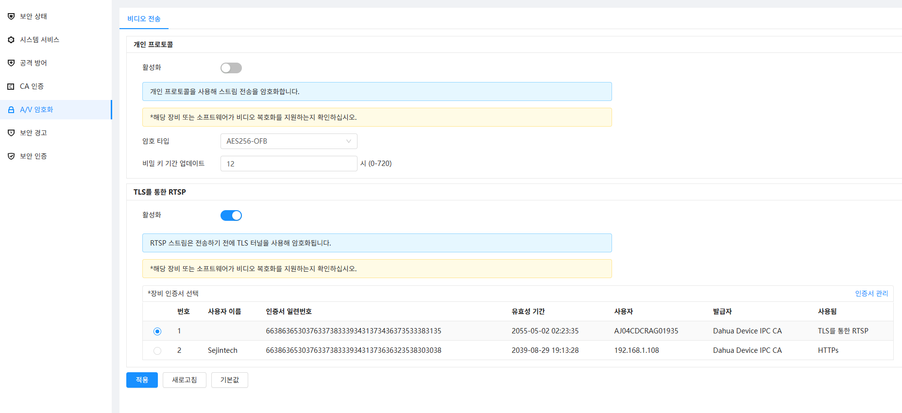
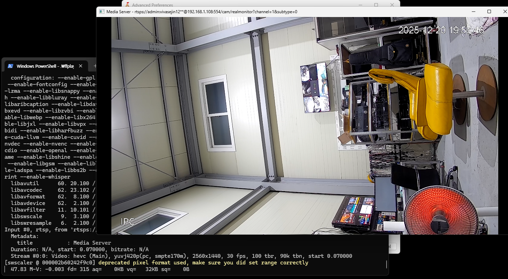

# IP 카메라용 보안기능 확인서 대응 요약본

본 문서는 **공공분야 영상정보처리기기(IP 카메라)**에 대해
**보안기능 확인서** 발급을 준비하는 제조사·개발사를 위한
**1~2페이지 분량의 실무 대응 요약본**이다.

---

## 1. 목적 및 적용 범위

### 1.1 목적

* IP 카메라가 **국가 보안요구사항**을 만족함을 입증
* 보안기능 확인서 발급을 위한 **최소·필수 대응 사항 정리**

### 1.2 적용 범위

* TCP/IP 네트워크에 연결되는 모든 IP 카메라
* 실화상, 열화상, PTZ, 머신비전 등 **영상정보를 네트워크로 전송하는 장비**
* 시험 대상은 **하드웨어가 아닌 펌웨어(Firmware)**

---

## 2. 보안기능 확인서 개요 (IP 카메라 기준)

* 발급 주체: 시험기관(TTA 등)
* 유효기간: 기본 **5년**
* 기준 단위: **펌웨어 기준**
* 동일 펌웨어 사용 모델은 **동일성 확인으로 묶음 처리 가능**

⚠️ 펌웨어 권한·책임 주체가 명확하지 않으면 시험 불가

---

## 3. 필수 보안 기능 요약 (IP 카메라 핵심)

### 3.1 사용자 식별·인증

* 관리자/사용자 계정 분리
* 평문 패스워드 저장 ❌
* 저장 시 **salt + 해시 + iteration 적용**
* 로그인 시 재전송 공격 방지 (Challenge–Response 또는 TLS)

---

### 3.2 저장 데이터 보호

* 보호 대상:

  * 사용자 패스워드
  * 인증 정보
  * 암호키(DEK, KEK)
* 사용자 패스워드:

  * 일방향 해시 사용
  * salt ≥ 48bit
  * iteration ≥ 1000
* 암호키는 **하드코딩 금지**

---

### 3.3 자체시험(Self-Test)

* 부팅 시 또는 주기적으로 자체시험 수행
* 실패 시 반드시 대응 행동 수행

  * 프로세스 재시작
  * 경고 메시지 출력 등
* 자체시험 결과는 **감사기록으로 저장**

---

### 3.4 무결성 검증

* 검증 대상:

  * 설정 파일
  * 주요 실행 파일, 라이브러리, 프로세스
* 부팅 시 무결성 검증 필수
* 관리자 수동 실행 기능 제공
* 해시값(SHA-256 이상) 기반 검증
* 기준 해시값도 **보호 저장** 필요

---

### 3.5 업데이트 파일 유효성 검증

* 업데이트 전 반드시 유효성 검증 수행
* 허용 방식:

  * 전자서명 검증 (권장)
  * 공개된 해시값(SHA-256 이상) 비교
* 검증 실패 시 설치 차단
* 관리자만 업데이트 수행 가능
* 검증 결과는 감사기록으로 저장

❌ 검증 없는 자동 업데이트 금지

---

### 3.6 감사기록 관리

* 감사기록은 로컬 저장 또는 외부 전송
* 저장 공간 부족 예측 시 대응 필수

  * 임계값 예: 90%
* 관리자 알림 기능 필수

  * 화면 알람, 이메일 등
* 외부 로그 전송 시:

  * syslog over TLS/DTLS 사용

---

### 3.7 암호키 생성 및 관리

* 암호키 ≠ 사용자 패스워드
* 구분:

  * KEK: 키 암호화 키
  * DEK: 데이터 암호화 키
* KEK:

  * PBKDF2 기반 생성
  * salt ≥ 128bit
  * iteration ≥ 1000
  * 장비별 고유 생성
* DEK:

  * 난수발생기 기반 생성
  * KEK로 암호화하여 저장

---

## 4. 시험기관 확인 포인트 (IP 카메라)

* 평문 패스워드 저장 여부
* 동일 패스워드 → 동일 해시 여부
* 무결성 검증 실제 동작 여부
* 업데이트 파일 변조 시 설치 차단 여부
* 감사기록 누락 여부
* 암호키 하드코딩 여부

---

## 5. 제출 문서 필수 목록

* 보안기능 구현명세서
* 보안기능 시험 대상 설명서
* 암호 사용 및 키 관리 설명
* 취약점 개선내역서
* (필요 시) 펌웨어 권리·책임 계약서

---

## 6. IP 카메라 제조사 관점 결론

 IP 카메라는 더 이상 단순 영상 장비가 아니라
 **네트워크 기반 보안 IT 제품**으로 취급된다.

 펌웨어 보안기능, 암호 설계, 감사기록, 업데이트 검증이
 명확히 구현되지 않으면 공공시장 진입은 불가능하다.

---

### (부록) 최소 합격 전략 한 줄 요약

* 로그인 보안 + 저장 보안은 **별도 계층**으로 구현
* 무결성·업데이트·로그는 **실제로 동작**해야 함
* 모든 결과는 **감사기록으로 남길 것**


---

# 영상정보처리기기 제품군 국가용 보안요구사항
## IP카메라 보안요구사항 V3.0 (2024.04.03)


---

# 1절. 일반사항

## 1.1 운용 환경 정의
**가정사항**
- 제품의 인가된 관리자는 장비의 펌웨어 및 장비 내에서 사용되는 소프트웨어에 대한 최신 패치를 정기적으로 수행한다.
- 제품의 인가된 관리자는 웹브라우저 등을 통해 제품에 접속할 수 있으며, 이 때 HTTPS, TLS, SSH 등의 통신을 이용하여 암호통신 프로토콜을 수행한다.
- 제품은 로컬콘솔 형태의 접속이 불가능하며, 최초 및 운용을 위한 기본 접속 수단은 웹 브라우저이다.

**제품 개요**
- IP카메라는 사람 또는 사물의 영상 등을 촬영하고 선택적으로 오디오 획득도 가능하며, 영상과 오디오를 IP 네트워크를 통하여 전송할 수 있는 하드웨어 일체형 장비이다. 
- 전송하는 데이터는 영상(이미지 또는 비디오)이며 ~~관리자의 선택에 의해 오디오가 포함될 수 있다.~~ 
- 제품은 이미지 센서로 획득한 영상과 마이크로 획득한 오디오를 압축하여 IP 네트워크로 전송할 수 있으며 이를 위한 미디어 서버와 제어·관리를 위한 웹 서버를 포함하고 있다. 
- IP카메라 관리접속시 영상 모니터링이 가능해야 하며  IP카메라는 내장된 서버에서 영상을 송신한다. 
- IP카메라와 영상정보 관리·저장제품간의 연동을 위해 <별표 1>에 기재된 예시와 같은 영상 전송 관련 표준 프로토콜을 사용할 수 있다.

<table align="center">
  <tr><th colspan="3">〈별표 1〉 영상 전송 관련 표준 프로토콜 목록(예시)</th></tr>
  <tr><th>프로토콜</th><th>동작 형태</th><th>비고</th></tr>
  <tr><td>ONVIF</td><td>HTTPS/TCP<br>HTTP/TCP</td><td>
  - www.onvif.org<br>
  - IEC 60839-11-31:2016, IEC 62676-2-31:2019<br>
  - SOAP 기반의 HTTP/XML 메시지 프로토콜<br>
  &nbsp;&nbsp;(IP카메라의 영상 관련 정보 Read/Write)<br>
  - 영상 전송에 대해 RTP/RTSP 등의 표준 차용</td></tr>
  <tr><td>RTP</td><td>RTP/TCP<br>RTP/UDP</td><td>- RFC 3550<br>- KS C IEC 62676-2-1:2013<br>- 실질적인 Video 및 Audio Data 전송</td></tr>
  <tr><td>RTSP</td><td>RTSP/TCP<br>RTSP/UDP</td><td>- RFC 2326<br>- KS C IEC 62676-2-1:2013<br>- RTP 스트림 제어</td></tr>
  <tr><td>SRTP</td><td>SRTP/TCP<br>SRTP/UDP</td><td>- RFC 3711, 5763<br>- RTP 프로토콜의 확장판<br>- 각 RTP 패킷의 데이터를 Encryption하여 전송</td></tr>
  <tr><td>RTSPS</td><td>RTP/RTSP/TLS</td><td>- RFC 7826<br>- 각 RTSP 패킷의 데이터를 Encryption하여 전송</td></tr>
  <tr><td>HTTP Tunneling</td><td>RTP/RTSP/HTTP(S)/TCP</td><td>- RTP/RTSP 데이터를 HTTP Payload에 위치시키고 전송</td></tr>
  <tr><td>Websocket</td><td>RTP/RTSP/HTTP(S)/TCP</td><td>- RFC 6455<br>- RTP/RTSP 데이터를 Websocket 내에서 전송</td></tr>
</table>


**운용 환경**
- 영상정보처리기기가 운용되는 네트워크는 인터넷 및 업무·행정망과 분리된 별도 단독망 구성이 원칙이며, 원격지 등에 설치하여 단독망 구성이 불가할 경우 에는 VPN 등으로 암호화된 통신 구간에서 운용되어야 한다. 
- 제품에 대한 관리 단말(PC)이 별도로 운용될 수 있으며 관리 단말에서는 웹브라우저 접속 등의 방법으로 관리 활동이 이뤄질 수 있다. 
- IP카메라는 연동된 영상정보 관리·저장제품의 요청에 따라 데이터(영상 또는 오디오)를 제공할 수 있다. 
- 제품은 운용중 발생하는 로그의 외부 저장 및 관리를 위해 로그 서버, 시간 동기화를 위한 NTP 서버를 운용환경으로 포함할 수 있다. 
- 이외에 제품에 따라 기능 활용을 위해 필요한 외부 실체가 있는 경우 운용 환경에 추가적으로 제시될 수 있다. 
- 제품의 최초 관리자계정·비밀번호 설정 및 변경이 진행되지 않은 상태를 ‘기본(default) 상태’로 정의하며, 최초 관리자계정·비밀번호 설정 및 변경이 완료된 상태를 ‘운용 상태’로 정의한다. 
- 제품의 식별 및 인증 대상이 되는 사용자는 관리자이며, 제품이 제공하는 영상만을 취득하고자 하는 영상 모니터링 관리자 또한 식별 및 인증 대상에 포함된다.

***운용 환경 요구사항***
- 제품의 인가된 관리자는 다음의 지침 및 가이드에서 부여한 의무를 정확하게 수행해야 한다.

<table align="center">
  <tr><th>분야</th><th>명칭</th><th>주관기관</th></tr>
  <tr><td rowspan="3">공공</td>
      <td>국가정보보안기본지침</td><td rowspan="2">국가정보원</td></tr>
  <tr><td>국가·공공기관 영상정보처리기기 도입·운영 가이드</td></tr>
  <tr><td>공공기관 고정형 영상정보처리기기 설치·운영 가이드</td><td>개인정보보호위원회</td>
  </tr>
  <tr><td rowspan="2">국방</td><td>국방보안업무훈령</td><td rowspan="2">국방부</td></tr>
  <tr><td>국방정보보안시스템 업무훈령</td></tr>
</table>

- 제품의 인가된 사용자는 악의없이 도입한 목적에 맞게 제품을 운용해야 한다.
- 제품의 인가된 사용자는 제품이 제공하는 저장기능이 아닌 방법으로 영상을 저장하지 않아야 한다.
- 제품의 인가된 관리자는 감사기록 유실에 대비하여 감사 데이터 저장소의 여유 공간을 주기적으로 확인하고 감사기록이 소진되지 않도록 감사기록 백업(외부 로그 서버, 별도 저장장치 등) 등을 수행한다.
- 제품의 인가된 관리자는 제품 동작에 불필요한 운영체제상의 서비스나 수단 등을 제거하고 취약점에 대한 개선 작업을 통해 운영체제의 신뢰성과 안전성을 보장한다.
- 제품의 인가된 관리자는 네트워크 구성, 변경, 서비스의 증감 등으로 내부 네트워크 환경이 변화될 때, 변화된 환경과 보안정책을 즉시 제품 운용정책에 반영하여 이전과 동일한 수준의 보안을 유지한다.
- 제품은 외부 인터페이스에 저장 매체(SD Card, USB 메모리 등)가 연결되더라도 인식이 불가능해야 한다.

**공통보안요구사항의 적용**
- 공통보안요구사항을 적용하지 않는다.

---

# 2절. 보안요구사항
## 2.1 영상보안
제품은 영상정보의 저장, 전송 등에 대한 보안기능을 제공해야 한다

### 2.1.1 영상 프로토콜 인증
#### 2.1.1.1 (필수) 기기 간 연동 및 영상 관련 표준 프로토콜(ONVIF, RTSP 등)에서 사용자 인증 기능을 제공해야 한다
- ONVIF, RTSP 등 표준 프로토콜에서 사용자 인증 제공
- Digest 인증 사용 시 RFC 7616 준수
- 암호 알고리즘 보안강도 112bit 이상

### 2.1.2 영상 전송 보안
#### 2.1.2.1 (필수) 기기 간 연동 및 영상 전송 관련 표준 프로토콜 통신시 전송 데이터를 보호하기 위해 암호통신 채널을 사용하여 전송해야 한다.
- 암호통신을 위해서 표준 프로토콜(ONVIF, RTSP 등)을 사용하여 기밀성과 무결성을 제공해야 한다.
  - 암호통신 프로토콜은 HTTPS(TLS를 이용하여 구현), TLS(TLS 1.2- RFC5246 이상), SSH(SSH V2-RFC 4251, 4254) 등이 있다
- 자체 프로토콜 사용은 허용되지 않는다
- 사용 암호 알고리즘, 암호키 안전성 및 암호키 저장 방식은 ‘9. 암호 지원’ 요구사항을 만족해야 한다.
- HTTPS Tunneling(RTP/RTSP/HTTPS/TCP) 전송 방식을 사용할 수 있다.
- 사용 암호 알고리즘, 암호키 안전성 및 암호키 저장 방식은 ‘9. 암호 지원’ 요구사항을 만족해야 한다.

### 2.1.3 영상 저장 보안
#### 2.1.3.1 (조건부필수) 영상 저장시 암호화 저장 기능을 제공해야 한다.
- IP카메라는 비디오, 이미지 등 영상을 제품 내부 저장소에 저장할 경우 검증필 암호모듈(KCMVP)로 암호화하여 저장해야 한다.
- 제품은 영상정보 관리·저장제품 이외 외부 IT실체에 영상정보를 파일로 제공하는 경우에는 파일을 암호화하여 제공해야 한다.
- 저장하는 영상 스트림 중 모든 I-프레임은 암호화해야하며 다른 데이터는 개발업체의 선택에 따라 암호화될 수 있다.
- 제품 내부 저장소에 저장된 영상의 일부를 제품 외부에 파일형태로 백업하는 기능을 제공할 경우, 암호화 및 무결성 검증 기능을 제공해야 한다

#### 2.1.3.2 (조건부필수) 카메라의 오디오 녹음을 on·off 할 수 있는 기능을 제공해야 한다.
- 기본(default) 상태에서 오디오 녹음 기능은 ‘on’과 ‘off’가 모두 선택 가능해야 하며 초기값은 ‘off’로 설정되어야 한다.

### 2.1.4 영상 관리 보안
#### 2.1.4.1 (조건부필수) 제품은 관리도구에 의한 최초설정을 기본(default) 상태에서만 허용해야 한다.
- 관리도구의 기능은 장치 검색과 IP주소 설정 기능만 허용한다.
- 기본(default) 상태에서 운용 상태로 전환되면, 관리도구에 의한 설정에 사용되는 포트 및 서비스는 즉시 비활성화되어야 한다.
- 제품이 설정 초기화로 기본(default) 상태가 된 경우, 관리도구에 의한 설정은 다시 허용될 수 있다.

## 2.2 식별 및 인증
제품의 관리자, 일반사용자, 외부 IT실체, 영상 프로토콜에 대한 식별 및 인증 기능을 확인한다.
### 2.2.1 사용자 등 식별 및 인증
#### 2.2.1.1 (필수) 제품은 사용자의 신원을 검증하기 위해 사용자 계정·패스워드 기반 식별 및 인증 기능을 제공해야 한다.
- 사용자가 제품의 정당한 사용자임을 확인하기 위해 반드시 식별 및 인증을 수행해야 한다.
- 관리자는 각 사용자 또는 그룹별로 권한을 부여할 수 있어야 한다.
- 사용자 계정(ID)은 각각 고유한 값으로 등록되어 중복되지 않아야 한다.

#### 2.2.1.2 (조건부필수) 제품은 연동하는 외부 IT실체를 인증해야 한다.
- 영상정보 관리·저장제품 연동을 위한 패스워드, SNMP 인증 패스워드, SNMP 암호화 패스워드 등이 적용대상이 될 수 있다.

### 2.2.2 인증 실패 대응
#### 2.2.2.1 (필수) 제품에서 사용자 인증이 설정된 횟수만큼 연속적으로 실패하면, 식별 및 인증 기능이 비활성화 되어야 한다.
- 식별 및 인증 기능을 비활성화한 후 활성화 하는 방법의 예로써 계정잠금 후 지정된 시간이 지난 이후 활성화, 계정잠금 후 활성화를 위한 다른 식별 및 인증 수단 제공 등이 있다.

> 계정 잠금으로 5분 후에 재 활성화한다. 계정 잠금시간은 5분~1시간까지 설정할 수 있게 한다.

- 식별 및 인증이 비활성화되는 연속적인 인증 실패 횟수는 5회 이하의 값으로 고정되거나 5회 이하의 값으로 설정할 수 있어야 한다.
- 일정시간 동안 인증 기능을 비활성화하도록 구현하는 경우 재활성화까지 소요되는 시간은 5분 이상의 값으로 고정되거나 설정할 수 있어야 한다.

#### 2.2.2.2(필수) 제품은 관리자 인증시 설정된 횟수만큼 연속적으로 실패하면, 관리자가 즉시 확인할 수 있는 수단을 통해 통보해야 한다.
- 알람, 문자 메시지, 이메일 등 중에서 한 가지 이상의 수단을 통해 통보해야 한다.

> 우리는 이메일로 보내기로 한다. 카메라에 email을 설정하는 부분이 있다. 그 이메일을 통해서 보내기로 한다. 


### 2.2.3  패스워드 등 민감정보 생성 및 안전성 검증
#### 2.2.3.1 (필수) 제품은 패스워드 등록 및 변경시 <표 1>의 보안성 기준을 만족해야 한다.
<table align="center">
<tr> <th colspan="4">< 표 1. 패스워드 보안성 기준 유형(1)></th></tr>
<tr><th>구분</th><th>항목</th><th>요구사항</th><th>비고</th></tr>
<tr><td rowspan="6">준수사항</td><td>최소 길이</td><td><b>9자리 이상</b></td><td>필수</td></tr>
<tr><td>대문자 포함</td><td>영문 대문자 1자 이상 포함</td><td>A-Z</td></tr>
<tr><td>소문자 포함</td><td>영문 소문자 1자 이상 포함</td><td>a-z</td></tr>
<tr><td>숫자 포함</td><td>숫자 1자 이상 포함</td><td>0-9</td></tr>
<tr><td>특수문자 포함</td><td>특수문자 1자 이상 포함</td><td>!@#$%^&*() 등</td></tr>
<tr><td>복잡도</td><td>위 4가지 유형 모두 혼합 사용</td><td>필수</td></tr>
<tr><td rowspan="5">금지사항</td><td>ID 포함 금지</td><td>비밀번호에 사용자 ID와 동일한 문자열 포함 금지</td><td>ID가 <code>admin</code>이면 <code>admin123!</code> 금지</td></tr>
<tr><td>동일 문자 연속</td><td>동일한 문자 또는 숫자 연속 사용 금지</td><td><code>aaa</code>, <code>111</code>, <code>!!!</code> 금지</td></tr>
<tr><td>순차적 문자</td><td>키보드 연속 문자 순차 나열 금지</td><td><code>qwerty</code>, <code>asdf</code>, <code>1234</code> 금지</td></tr>
<tr><td>순차적 숫자</td><td>연속된 숫자 순차 나열 금지</td><td><code>123456</code>, <code>987654</code> 금지</td></tr>
<tr><td>이전 비밀번호</td><td>직전 사용 비밀번호 재사용 금지</td><td>최소 1회 이상 이력 관리</td></tr>
</table>

> 
```
비밀번호 유효성 검사:
├── ✅ 길이 >= 9자
├── ✅ 대문자 포함 (A-Z)
├── ✅ 소문자 포함 (a-z)
├── ✅ 숫자 포함 (0-9)
├── ✅ 특수문자 포함
├── ❌ ID 문자열 미포함
├── ❌ 동일 문자/숫자 3회 이상 연속 불가 (예: aaa, 111)
├── ❌ 키보드 순차 문자 3자 이상 불가 (예: qwe, asd)
├── ❌ 순차 숫자 3자 이상 불가 (예: 123, 987)
└── ❌ 직전 비밀번호와 동일 불가
```
> 

#### 2.2.3.2 (조건부필수) 제품은 외부 IT실체 인증에 필요한 정보를 설정하는 기능을 제공해야 한다.
- 적용대상으로 영상정보 관리·저장제품 연동을 위한 패스워드, SNMP 인증·암호화 패스워드 등이 될 수 있다.
- 외부 IT실체 인증에 패스워드가 사용되는 경우 △2.3.1의 보안성 기준을 준수해야 한다.
 
> 해당사항 없슴


### 2.2.4 인증정보 재사용 방지
#### 2.2.4.1 (필수) 제품은 사용자 인증 정보의 재사용을 방지해야 한다.
- △1.1.1과 △2.1.1에서 규정한 식별 및 인증에 사용되는 인증 정보에 필수적으로 적용한다.
- 세션 ID를 암호화하거나 세션 ID의 유일성을 보장(타임스탬프, 세션 만료시간 설정 등)하여 방지할 수 있다.
- 제품에서 재사용이 금지된 인증 정보의 재사용 시도를 탐지한 경우 인증에 실패해야 하며 인증 실패 사건에 대한 감사기록을 생성해야 한다.
- 제품이 외부 IT실체의 추가적인 식별 및 인증 수행 결과만을 전달받는 경우 해당 인증 정보의 재사용 방지는 외부 IT실체에서 제공한다고 가정한다.
- 세션 만료시간은 제공 서비스 특성을 고려하여 최소화 할 수 있는 값으로 설정해야 한다.

> 세션 타임아웃에 관련된 내용이다.  일정시간이 지나면 세션이 만료되어 재 로그인 하지 않고는 장비를 사용할 수 없다.
> 이게 브라우저에만 해당하는지 확인 필요. 
> 일반 VMS에서 새션을 타임아웃하면 일정시간마다 session을 다시 받아야 함.


### 2.2.5 인증 피드백 보호
#### 2.2.5.1 (필수 )제품은 인증에서 사용되는 정보를 출력장치에 표시할 때 내용을 표시하지 않아야 한다.
- △1.1.1 △2.1.1 △2.3.1에서 규정한 인증 정보가 출력장치에 표시되는 경우에 적용한다. 
- 인증에 사용되는 정보는 입력내용의 미표시, 입력문자 대신 “✽”으로 표시 등의 형태로 출력해야 한다.
- 사용자 로그인시 인증 정보가 메모리 영역에 평문으로 노출되지 않아야 한다

> 이미 구현됨.
> password 전송시에 md5 또는 sha 형태로 api 전송하고 있는 것으로 보임
> http, https 모두 적용되었는데, 우리는 http 서비스를 삭제할 예정, https만 지원
> onvif 지원은 다시 확인 필요


#### 2.2.5.2 (필수) 제품은 식별 및 인증 실패시, 실패 사유에 대한 피드백(존재하지 않는 계정(ID), 패스워드 오류 등)을 제공하지 않아야 한다.
- 잘못된 인증 정보 입력으로 인증실패 유도 후, 알림 메시지에 인증 실패 사유를 추측할 수 있는 피드백을 제공하는지 확인해야 한다

> 제공하지 않아야 된다는 의미이고, 메시지로 "로그인에 실패하였습니다."하는 메시지만 나오면 됨

> 1. LOGIN 인증 절차   
> 1 단계: Login Challenge (도전 요청), 
> 나는 admin으로 login 하고 싶다. 
> 실제 비밀번호는 안보냄
> ```
> api: https://192.168.1.108/RPC2_Login, POST
> payload: {
>   "method": "global.login",
>    "params": {
>        "userName": "admin",
>        "password": "",
>        "clientType": "Web5.0"
>    },
>    "id": 4
> }
> response: {
>    "error": {
>        "code": 268632079,
>        "message": "Component error: login challenge!"
>    },
>    "id": 4,
>    "params": {
>        "authorityType": [
>            "Default"
>        ],
>        "authorization": "839f13ba728facbb140cc2661b3bc411c732cc01",
>        "encryption": "Default",
>        "opaque": "dedd77794be40cf3f62ea082603def22",
>        "qop": [
>            "auth"
>        ],
>        "random": "538113986",
>        "realm": "Login to dd1176c88fde59a5d01a6be0c45b9630"
>    },
>    "result": false,
>    "session": "52939a29eca737f081deda87da696c9f"
> }  
> ```
> 응답:
> |필드| 의미|
> |:---:|:---|
> | `realm`         | 인증 영역 식별자 (Digest 표준)        |
> | `random`        | **nonce** (일회성 난수)              |
> | `opaque`        | 서버 상태 보호용 토큰                 |
> | `qop`           | quality of protection (`auth`)     |
> | `authorization` | 서버 내부 검증용                     |
> | `session`       | 인증 전 임시 세션                    |

> 2 단계:
> ```
> api: https://192.168.1.108/RPC2_Login, POST
> payload: {
>    "method": "global.login",
>    "params": {
>        "userName": "admin",
>        "password": "E79DA7D56990E0388BAA5E3889A39361",
>        "clientType": "Web5.0",
>        "realm": "Login to dd1176c88fde59a5d01a6be0c45b9630",
>        "random": "538113986",
>        "passwordType": "Default",
>        "authorityType": "Default"
>    },
>    "id": 5,
>    "session": "52939a29eca737f081deda87da696c9f"
> }
> ```
> password 필드의 정체
> ```
> HA1 = MD5(username : realm : real_password)
> HA2 = MD5(method : uri)
> response = MD5(HA1 : nonce : HA2)
> ```


```
{
    "id": 5,
    "params": {
        "isPwdOverdue": false,
        "keepAliveInterval": 60
    },
    "result": true,
    "session": "0894fe47140a204e65b892b3b4da86ad"
}
```
> 여기서 session은 browser의 cookie에 저장된다. 
> 이 인증 흐름은 **표준 HTTP Digest 인증을 JSON-RPC 형태로 감싼 “Challenge–Response 기반 사용자 인증”**입니다.
> 국정원/시험기관 관점에서도 매우 정상적이고 좋은 구조예요.  
> 요약: 카메라는 평문 비밀번호를 절대 받지 않고,
>   - 1단계에서 nonce(random)를 내려주고,  
>   - 2단계에서 Digest 해시로 검증하는 구조입니다.

## 2.3 보안관리
인가된 관리자만이 제품의 보안기능 및 중요데이터에 대한 관리를 수행하도록 허용함으로써 제품의 보안관리를 위한 요구사항을 만족하는지 확인한다.
### 2.3.1 보안관리 기능
#### 2.3.1.1 (필수) 제품은 인가된 관리자에게 보안기능, 보안정책, 중요 데이터 등을 설정 및 관리할 수 있는 보안관리 기능을 제공해야 한다.
- 보안관리 기능에 해당되는 사항은 다음과 같다.
    * 보안기능의 동작을 결정할 수 있는 조건 또는 규칙을 추가, 삭제, 변경하는 기능.
    * 조건 또는 규칙에 따라 제품이 수행해야 할 행동을 추가, 제거, 변경하는 기능.
    * 제품의 설정을 선택, 변경하는 기능.
    * 카메라 제어를 설정, 변경하는 기능.
- 제품이 구현해야 하는 보안관리 기능은 아래 <표 2> 와 같다.

<table align="center">
<tr><th colspan="3">< 표 2. 제품이 구현해야하는 보안관리 기능 ></th></tr>
  <tr><th>소분류</th><th>보안관리</th><th>비고</th></tr>
  <tr><td rowspan="6">식별 및 인증</td>
    <td>사용자의 등록, 삭제, 수정, 권한 부여</td>
    <td>제품에 등록된 사용자가 유일한 경우 해당사항 없음</td></tr>
  <tr><td>사용자의 패스워드 조합·길이 정책 설정</td>
    <td>기능 제공시 필수</td></tr>
  <tr><td>사용자의 인증 실패 허용 횟수 설정</td>
    <td>기능 제공시 필수</td></tr>
  <tr><td>사용자의 인증 실패 대응방법 설정</td>
    <td>기능 제공시 필수</td></tr>
  <tr><td>사용자 인증 기능 비활성화된 후 활성화까지의 시간 설정</td>
    <td>기능 제공시 필수</td></tr>
  <tr><td>제품이 인증하는 외부 IT실체 인증정보 설정</td>
    <td>기능 제공시 필수</td></tr>
  <tr><td rowspan="6">보안 관리</td>
    <td>관리용 단말기의 IP 등록, 삭제, 수정</td>
    <td></td></tr>
  <tr><td>중요 데이터, 설정정보, 감사기록 등의 백업</td>
    <td>기능 제공시 필수</td></tr>
  <tr><td>중요 데이터, 설정정보, 감사기록 등의 복구</td>
    <td>기능 제공시 필수</td></tr>
  <tr><td>관리접속 서비스 활성화, 비활성화</td>
    <td>기능 제공시 필수</td></tr>
  <tr><td>외부 IT실체 접근을 위한 인증정보 설정</td>
    <td>기능 제공시 필수</td></tr>
  <tr><td>카메라 제어(PTZ 등) 설정 및 동작 설정 초기화</td>
    <td>기능 제공시 필수</td></tr>
  <tr><td rowspan="4">자체보호</td>
    <td>관리자 요청에 의한 제품의 보안기능 자체시험 수행</td>
    <td>기능 제공시 필수</td></tr>
  <tr><td>자체시험 실패시 대응행동 설정</td>
    <td>기능 제공시 필수</td></tr>
  <tr><td>관리자 요청에 의한 제품의 설정값 및 제품 자체의 무결성 검사 수행</td>
    <td></td></tr>
  <tr><td>무결성 검사 실패시 대응행동 설정</td>
    <td>기능 제공시 필수</td></tr>
  <tr><td rowspan="3">업데이트 보호</td>
    <td>관리자에 의한 업데이트 파일 유효성 수동 검증</td>
    <td>기능 제공시 필수</td></tr>
  <tr><td>관리자에 의한 업데이트 파일 설치 실패 수동 복구</td>
    <td>기능 제공시 필수</td></tr>
  <tr><td>제품 버전정보 조회</td>
    <td></td></tr>
  <tr><td rowspan="3">세션 관리</td>
    <td>사용자 세션 잠금, 종료 시간 설정</td>
    <td>기능 제공시 필수</td></tr>
  <tr><td>(세션 잠금의 경우) 세션의 잠금 해제시 관리자 또는 개별 사용자 인증</td>
    <td></td></tr>
  <tr><td>사용자 동시 젒고 세션수 설정</td>
    <td>기능 제공시 필수</td></tr>
  <tr><td rowspan="2">감사 기록 </td>
    <td>감사 기록 조회</td>
    <td></td></tr>
  <tr><td>감사기록 손실 대응 관련 설정</td>
    <td>기능 제공시 필수</td></tr>  
</table>


### 2.3.2.1 관리 접속 기능
#### 2.3.2.1 (필수) 제품은 모든 관리접속에 대해 활성화·비활성화 기능을 제공해야 한다.
- 시험원은 제품에서 지원하는 모든 관리접속을 조사해야 한다.
- 제품의 기본 접속 수단인 웹브라우저(HTTPS) 접속은 기본(default) 상태에서 활성화를 허용하며, 다른 모든 관리접속은 기본(default) 상태에서 비활성화되어 있어야 한다. 
- 다만, 제품이 관리도구에 의한 최초 설정이 필요할 경우에는 △1.4.1의 요구사항에 따른 관리도구 접속의 활성화가 추가로 허용될 수 있다.
- 제품 외부에서 포트스캔을 수행하여 불필요한 포트가 존재하는지 확인해야 한다.
- 제품 내에서 운용되는 DBMS에 대해 원격으로 직접 접근하는 것은 제한되야 한다.
- 외부에서 접근 가능한 API를 제공하는 장비의 경우, 시험원은 해당 서비스에 대한 활성화·비활성화 기능 여부를 확인해야 한다.
- 시험원은 제품에서 관리접속이 암호통신만을 사용하는지 확인해야 한다.
> HTTP 서비스를 삭제해야 한다. 
> 각 기능에대서 on/off 할 수 있는 기능들은 이미 구현이 되어 있다.
> 불필요한 서비스(P2P, PPPOE, TCP, Bonjour, 자동등록, 플랫폼 접속 등) 삭제
> 개인 프로토콜이라는게 있는데 뭔지 잘 모름

### 2.3.3 보안관리용 IP 제한
#### 2.3.3.1 (필수) 제품은 접속 가능한 관리용 단말기의 IP를 제한하는 기능을 제공해야 한다.
- 관리용 단말기 IP 주소를 등록, 삭제, 수정 가능해야 한다.
- 관리 용도 대신에 읽기 권한만 가지는 관리자(영상 모니터링 관리자 등)가 접속 가능한 관리용 단말기는 추가로 등록해서 운용 가능하다.
- 접속 가능한 관리용 단말기의 IP는 단일 호스트 단위로 1개씩만 추가 가능하다.
- 192.168.10.2~253 등과 같이 IP 주소 범위를 지정하여 추가하는 방식 또는 네트워크 전체 범위를 의미하는 0.0.0.0, 192.168.10.*, any 등을 이용한 등록은 허용되지 않는다.
- 기본(default) 상태에서 운용 상태로 전환되기 전, 접속 가능한 관리용 단말기의 IP를 등록하는 과정이 있어야 한다.
> 네트웤 설정혹은 보안  메뉴 추가
> 접속 가능한 IP 설정, 그리고 권한(보기? 관리?)

### 2.3.4 기본 게공되는 계정 및 패스워드 등의 관리
#### 2.3.4.1(필수) 제품은 최초 제품 접속(웹 브라우저 접속 등) 시 기본 제공되는 계정에 대한 강제 변경·사용중지하는 기능을 제공해야 한다.
- 최초 접속시, 기본 제공되는 계정을 화면에 출력해야 한다.
- 기본 제공되는 계정은 최초 접속시 강제 변경 또는 사용중지(Disable)되어야 한다.
- 기본 제공되는 계정이 없는 경우, 신규 계정을 생성해야 하며 이후 제품의 관리 접속이 가능해야 한다.
- 계정을 변경하거나 신규 생성할 경우, 유추가 가능한 명칭(root, admin, 업체명, 카메라 모델명 등)은 허용하지 않아야 한다.
> 아마 백도어 계정이 있을까봐 그런것 같다.

#### 2.3.4.2 (필수) 제품은 최초 제품 접속(웹 브라우저 접속 등) 시 관리자 기본(default) 패스워드를 강제 변경·생성하는 기능을 제공해야 
한다.
- 기본(default) 패스워드가 존재하는 경우 최초 제품 접속시 기본(default) 패스워드를 변경하는 기능을 제공해야 하며, 이후 제품의 관리 접속이 가능해야 한다.
- 기본(default) 패스워드가 없는 경우, 신규 패스워드를 생성해야 하며, 이후 제품의 관리접속이 가능해야 한다.- 패스워드는 2.3.1의 보안성 기준을 준수해야 한다.
- 제품의 모든 기능은 기본(default) 패스워드 변경 또는 생성이 진행된 이후에만 동작되는지 확인해야 한다.

> 최초 접속시에 ID와 비밀번호를 입력하는 페이지가 나오는데, 좀더 간소화 할 필요가 있을 것 같다.

#### 2.3.4.3 (조건부필수) 제품은 내부 구성요소 또는 외부 IT실체에 접근하기 위해 사용하는 기본(default) 패스워드를 변경하는 기능을 제공해야 한다.
- 기본(default) 패스워드의 예시로는 DBMS 패스워드, 웹서버ㆍWAS서버 패스워드 등이 있다.
- 제품이 DBMS에 접근하기 위한 기본(default) 패스워드를 저장하는 경우 제품에서 기본(default) 패스워드를 변경하는 기능을 제공해야 한다.
- 제품이 웹서버ㆍWAS서버에 접근하기 위한 기본(default) 패스워드를 저장하는 경우 기본(default) 패스워드를 변경하는 기능을 제공해야 한다.
- 패스워드 생성시 추가적 식별 및 인증 기능 병행 유무에 따라 2.3.1의 보안성 기준을 준수해야 한다.
- 제품에 DBMSㆍ웹서버ㆍWAS서버에 접근하기 위한 기본(default) 계정(ID)이 존재하는 경우 이를 변경하는 기능을 제공할 수 있다.
- 제품 내에 DBMSㆍ웹서버ㆍWAS서버 등을 포함할 수 있고, 제품 외부에 별도로 존재하는 DBMSㆍ웹서버ㆍWAS서버 등과 연동할 수도 있다.
-  패스워드 보안성 기준에 포함된 문자라도 연동하는 외부 IT실체에서 입력을 허용하지 않는 문자는 포함하지 않을 수 있다.
> 해당사항 없게 외부에 데이터를 보내는 작업을 하지 말기. \
> 혹은 rtmp 같은 서비스를 해야 한다면, 이미 구현되어 있슴

#### 2.3.4.4 (조건부 필수) 제품은 외부 IT실체로부터 인증받기 위해 필요한 인증정보를 설정하는 기능을 제공해야 한다.
- 인증정보의 예시로는 SMTP 서버에서 제품을 인증하기 위해 사용하는 패스워드 등이 있다.
- 패스워드는 ‘서버 공통보안요구사항 1.3.2’에 규정된 보안성 기준의 준수를 권고한다.
- 다만, 패스워드 보안성 기준에 포함된 문자라도 연동하는 외부 IT실체에서 입력을 허용하지 않는 문자는 포함하지 않을 수 있다.

> 

## 2.4. 데이터 보호
제품이 사용자 또는 외부 IT실체와의 통신 간에 전송되는 데이터를 노출ㆍ변경으로부터 보호하기 위해 암호통신을 지원하는지 확인한다. 제품은 저장소에 저장되는 보안기능 관련 데이터를 비인가 노출로부터 보호해야 한다.

### 2.4.1 전송 데이터 보호
#### 2.4.1.1 <font color="FF0000">(필수)</font> 제품은 관리접속시 전송 데이터를 보호하기 위해 암호통신 채널을 사용하여 전송해야 한다.
- 암호통신을 위해서 표준 프로토콜을 사용하여 기밀성과 무결성을 제공해야 한다.
- 암호통신 프로토콜은 HTTPS(TLS를 이용하여 구현), TLS(TLS 1.2- RFC5246 이상), SSH(SSH V2-RFC 4251, 4254) 등이 있다.
- 자체 프로토콜 사용은 허용되지 않는다.
- 암호통신 채널은 제품에 직접 구현하거나 제품이 운영환경을 이용하여 제공하도록 구현될 수 있다.
- 사용 암호 알고리즘, 암호키 안전성 및 암호키 저장 방식은 ‘9. 암호 지원’ 요구사항을 만족해야 한다.
- 제품의 기본(default) 상태에서 관리도구와의 통신은 이 요구사항을 적용하지 않을 수 있다.

> 우리는 TLS 를 사용할거다. Https, websocket over TLS(wss), rtsp over TLS(rtsps)  
> rtsps(rtsp over TLS) 설정 화면 
> rtsps(rtsp over TLS) 재생 화면 

#### 2.4.1.2 (조건부필수) 제품은 외부 IT실체와 연동시 전송 데이터를 보호하기 위해 암호통신 채널을 사용하여 전송해야 한다.
- 암호통신을 위해서 표준 프로토콜을 사용하여 기밀성과 무결성을 제공해야 한다.
- 암호통신 프로토콜은 HTTPS(TLS를 이용하여 구현), TLS(TLS 1.2-RFC5246 이상), SSH(SSH V2-RFC 4251, 4254) 등이 있다.
- 자체 프로토콜 사용은 허용되지 않는다.
- 암호통신 채널은 제품에 직접 구현하거나 제품이 운영환경을 이용하여 제공 하도록 구현될 수 있다.
- 제품이 보안기능을 제공하기 위해 외부 IT실체와 연동하는 기능을 제공하는 경우 이 요구사항을 적용해야 한다.
- 외부 IT실체와 연동시 암호통신 채널을 사용하여 전송 데이터를 보호하지 않는다면 전송 데이터 기밀성, 무결성 보호의 불필요성이 입증되어야 한다.
- 암호통신 채널을 지원하지 않는 통신서비스는 비활성화 할 수 있어야 한다.
- 사용 암호 알고리즘, 암호키 안전성 및 암호키 저장 방식은 ‘9. 암호 지원’ 요구사항을 만족해야 한다.
- 외부 IT실체는 인증서버, SNMP 서버, 업데이트 서버, 로그서버 등이 있으며, 도입기관에서 허용하는 NTP 서버 등과의 평문 통신은 이 요구사항을 적용하지 않을 수 있다.

### 2.4.2 저장 데이터 보호
#### 2.4.2.1 (필수) 중요정보를 제품 내부에 저장할 때 정해진 방식으로 저장해야 한다.
- 최소한 다음의 중요정보를 제품이 저장하는 경우 암호화하여 저장해야 한다.
  - 제품이 사용자 식별 및 인증을 위해 사용하는 패스워드.
  - 제품이 추가적인 식별 및 인증을 위해 사용되는 인증정보.
  - 데이터 암호화 키(DEK: Data Encryption Key)
- 데이터 암호화 키(DEK)는 키 암호화 키(KEK : Key Encryption Key)를 사용, 암호화하여 저장해야 한다.
- 키 암호화 키(KEK) 생성 및 저장 등과 관련된 요구사항은 ‘9.2 암호키 생성’ 및 ‘9.3 암호키 저장’ 요구사항을 만족해야 한다.
- 다음과 같은 정보를 제품이 저장하는 경우 암호화, 접근통제 등의 방식으로 저장해야 한다.
  - 제품과 외부 IT실체의 연동시 상호간 인증에 사용되는 정보.
  - 제품이 제품 내부 또는 외부에 존재하는 DBMSㆍ웹서버ㆍWAS서버에 접근하기 위해 필요한 DBMSㆍ웹서버ㆍWAS서버 관리자 패스워드.
  - 암호키.(사전공유키, 대칭키, 개인키)
  - 조직의 중요정보를 포함하는 탐지 규칙, 시그니처 등.
- 제품이 사용자 식별·인증을 위해 사용하는 사용자 패스워드는 일방향 암호(해시) 또는 양방향 암호를 이용하여 저장해야 한다.
  - 일방향 암호화 수행시 패스워드에 salt라는 랜덤하게 생성한 값을 추가하여 적용할 필요가 있다.
  - salt 값은 비밀일 필요는 없으며, 난수발생기를 이용하여 생성하고 크기는 최소 48bit 이상이어야 한다.
  - iteration count는 가능한 큰 값을 적용해야 한다.(최소 1000회 이상)
- 제품 운영에 필요한 DBMSㆍ웹서버ㆍWAS서버 관리자 패스워드 등은 공개키ㆍ대칭키 암호 알고리즘을 적용하여 암호화하여 저장할 수 있다.
- 암호키는 사전공유키, 대칭키, 개인키 등을 의미하며 제품 관리접속ㆍ로컬접속, 제품 구성요소간 연동 설정에 사용되는 키들이 모두 대상이다.
- 암호화해서 저장해야 하는 최소한의 중요정보에 포함된 패스워드 및 암호키는 제품에 하드코딩하여 저장할 수 없다.
- 신청업체는 제품이 지원하는 저장 데이터 보호 방법에 대한 상세한 설명자료(「보안기능 구현명세서」)를 제출하여 안전성을 입증해야 한다.
- 사용 암호 알고리즘, 암호키 안전성 및 암호키 저장 방식은 ‘9. 암호 지원’ 요구사항을 만족해야 한다.
- 검증필 암호모듈(KCMVP)의 사용을 권고한다. 

**참고 사항**
- 제품을 운용하는 조직의 중요정보가 통합보안관리, 침입방지시스템 제품의 탐지 규칙, 시그니처 등에 포함될시 노출로부터 보호하는 방식으로 저장해야 한다.
- 저장된 모든 중요정보는 읽거나 유추할 수 없어야 한다.
- 난수발생기는 ‘9. 암호 지원’ 요구사항에 따라 국내ㆍ외 표준을 준수하여 구현되어야 한다.
> 초기 패스워드 설정에서 
```
salt = Random(); 
stored_hash = Hash(salt + password)
BD에 user_id, salt, stored_hash 를 저장
```
> 현재 구현된 방식 카메라는 평문 비밀번호를 절대 받지 않고, 1단계에서 nonce(random)를 내려주고,2단계에서 Digest 해시로 검증하는 구조이다.

> 본 제품은 로그인 시 Digest 기반 Challenge–Response 인증을 사용하며, 저장되는 사용자 패스워드는 별도로 사용자별 salt를 적용한 SHA 기반 일방향 해시로 저장됩니다. salt는 난수로 생성되며 48bit 이상이고, iteration count는 1000회 이상 적용됩니다.

> 카메라 내부에서 어떻게 저장하는 지 확인 필요

#### 2.4.2.2 (필수) 제품은 저장된 제품 설정값(보안정책, 환경설정 매개변수 등)에 인가된 관리자만이 접근할 수 있도록 보호하는 기능을 제공해야 한다

- 제품은 인가된 관리자만이 제품 설정값에 접근할 수 있도록 하는 인터페이스를 제공해야 하며, 인가된 관리자 외에는 제품 설정값에 접근할 수 없어야 한다.
  - 접근이라 함은 읽기, 변경, 삭제 등의 오퍼레이션을 의미한다.
- 제품 설정값을 외부에 파일형태로 백업하는 기능을 제공할 경우, 암호화하는 기능을 제공해야 한다.
- 암호화시 사용 암호 알고리즘, 암호키 안전성 및 암호키 저장 방식은 ‘9. 암호 지원’ 요구사항을 만족해야 한다.

## 2.5. 자체 보호
제품은 보안기능이 정상적으로 동작함을 보장하기 위해서 주기적 또는 관리자 요청에 의해 자체시험을 수행할 수 있어야 한다. 보안기능을 제공하는 메커니즘 및 데이터의 무결성을 확인하여 제품의 보안 기능을 보호해야 한다.
### 2.5.1 보안기능 자체 시험
#### 2.5.1.1 <span style="color:red">(필수)</span> <u>제품은 구동(또는 실행)·운용중에 주기적 또는 관리자의 요청에 의해 자체시험을 수행해야 한다.</u>
- 제품 구동(또는 실행)시 필수로 자체시험을 수행해야 하고 운용중에는 주기적 또는 관리자의 요청에 의한 수행을 지원해야 한다.
- 자체시험 대상은 제품의 주요 프로세스를 의미하며 프로세스가 정상적으로 실행되고 있는지 확인해야 한다.
- 자체시험 대상은 신청업체가 선택 가능하나, 시험 대상이 되는 실체의 비정상 상태(오류, 정지 등)로 인하여 제품의 보안 기능에 영향을 미치는 경우 해당 실체는 자체시험 대상으로 반드시 포함해야 한다.
- 자체시험 수행 이력은 화면 출력, 감사기록을 통해 확인할 수 있어야 한다.
- 제품 시작시 및 운영중 제품 범위에 포함되는 하드웨어(메모리, 플래시, NIC 등) 및 소프트웨어(프로세스 등)의 오류를 탐지할 수 있는 자체시험을 수행해야 한다.
- 신청기관은 제출문서에 자체시험 기능에 대해 상세히 기술해야한다.
> 자체 시험의 의미
> 제품이 스스로 확인하는 건강검진입니다. \
> 예:
> 주요 프로세스가 살아 있는지, 영상 스트림 모듈이 정상인지, 메모리/스토리지 오류가 없는지, 무결성 검증이 통과했는지 \
>이 시험의 결과는: 성공, 실패 둘 중 하나입니다.

#### 2.5.1.2 (필수) 제품의 자체시험 결과가 실패인 경우 대응기능을 수행해야 한다.
- 제품은 정확한 작동을 보장하기 위해 구현된 대응 기능을 수행하거나 관리자가 설정한 대응 기능을 수행해야 한다.
- 자체시험 결과에 대한 감사기록을 생성해야 한다.
- 자체시험 결과 실패시 수행하는 대응기능의 예로써 프로그램 실행중단, 경고메시지 화면 출력, 프로세스 재구동 등이 있다.
- 관리자가 대응기능을 설정할 수 있도록 보안관리 기능을 제공할 수 있다.
> 자체시험(Self-Test)이 실패하면, 제품은 그냥 계속 돌면 안 되고, 정해진 ‘대응 행동’을 반드시 해야 하며, 그 사실을 기록해야 한다. \
> 실패하면 미리 정해진 대응을 하거나 관리자가 선택해 둔 대응을 해야 한다. \
> 언제 실행했는지, 성공인지 실패인지 기록으로 남겨야 한다.
```
[부팅 또는 주기적 자체시험]
        ↓
[자체시험 실패]
        ↓
[정해진 대응 실행]
   - 프로세스 재시작
   - 또는 경고 출력
        ↓
[감사기록 생성]
```

### 2.5.2 무결성 검증
#### 2.5.2.1 (필수) 제품은 자체 및 설정값의 무결성을 검증하는 기능을 제공해야 한다.
- 무결성 검증 대상은 제품의 설정값(환경설정파일 등) 및 제품 자체(프로세스, 라이브러리, 실행파일 등)이다.
- 제품을 처음 실행시(또는 구동시) 무결성 검증을 수행해야 하며, 부가적으로 주기적인 무결성 검증을 수행할 수 있다.
- 무결성 검증 대상은 신청업체가 선택 가능하나, 검증 대상이 되는 실체의 비정상 상태(오류, 정지 등)로 인하여 제품의 보안 기능에 영향을 미치는 경우 해당 실체는 무결성 검증 대상으로 반드시 포함해야 한다.
- 관리자가 무결성 검증을 수행하는 기능을 제공해야 한다.
- 신청업체는 제품이 지원하는 무결성 검증 기능에 대한 상세한 설명자료(「보안기능 구현명세서」)를 제출해야 한다.
- 사용 암호 알고리즘, 암호키 안전성 및 암호키 저장 방식은 ‘9. 암호 지원’ 요구사항을 만족해야 한다.
- 제품이 자동으로 무결성 검증을 수행하는 주기는 1일 이내의 값으로 고정 또는 설정 가능한지 확인해야 한다.
- 해시값 비교 방법으로 무결성 점검 기능을 수행할 때 원본 해시값이 파일 시스템에 저장되는 형태일 경우, 원본 해시값이 보호되는지 확인해야 한다.
- 시험원은 제품의 무결성 검증을 위한 데이터가 저장될 때 ‘4.2 저장 데이터 보호’ 요구사항에 따라 저장되는지 확인해야 한다.
> 제품이 시작할 때와 운용 중에, 설정값과 핵심 실행 요소가 변조되지 않았는지 스스로 확인하고, 그 결과를 관리자가 확인·수행할 수 있어야 한다. \
> 언제 검사? 필수: 부팅/실행 시 1회, 선택: 주기적 검사 (자동, <24시간 주기), 자동검사가 없다면 관리자 수동 실행 \
> 시험관은 파일 하나 변경 (설정 파일 1바이트 수정) --> 재부팅 -> 결과 확인: 무결성 실패 감지되는지? 로그 남는지? 관리자 화면에 보이는지?

> 보안기능 구현명세서에 반드시 포함:
> - 무결성 검증 대상
> - 검증 시점
> - 해시 알고리즘
> - 기준값 저장 방식
> - 실패 시 대응

> 본 제품은 부팅 시 설정 파일 및 주요 실행 파일에 대해 SHA-256 기반 무결성 검증을 수행합니다. 관리자는 웹 UI를 통해 수동 검증을 실행할 수 있으며, 기준 해시값은 암호화하여 저장됩니다. 무결성 검증 실패 시 로그를 생성하고 관리자에게 알립니다


#### 2.5.2.2 (필수) 제품은 운영체제 커널 또는 커널 레벨 모듈에 대한 무결성을 검증하는 기능을 제공해야 한다.
- 해시값 비교 방법으로 무결성 검증시 사용 암호 알고리즘, 암호키 안전성 및 암호키 저장 방식은 ‘9. 암호 지원’ 요구사항을 만족해야 한다.

#### 2.5.2.3 (필수) 제품은 무결성 검증 내용 및 결과를 관리자가 확인하는 기능을 제공해야 한다.
- 무결성 검증 내용 및 결과는 화면 출력, 감사기록을 통해 확인할 수 있어야 한다.
#### 2.5.2.4 (필수) 제품은 무결성 검증 실패인 경우 대응 기능을 수행해야 한다.
- 제품은 자체에 구현된 대응기능을 수행하거나 관리자가 설정한 대응 기능을 수행해야 한다.
- 무결성 검증 결과에 대한 감사기록을 생성해야 한다.
- 무결성 검증 결과 실패시 수행하는 대응 기능의 예로써 프로그램 실행중단, <u>경고메시지 화면 출력</u> 등이 있다.
- 관리자가 대응기능을 설정 할 수 있도록 보안관리 기능을 제공할 수 있다.


### 2.6 업데이트 보호
제품은 제품 설치 파일, 제품 운영에 필요한 파일 등 ‘업데이트 파일’을 설치 또는 적용하는 기능을 제공할 수 있다. 제품은 업데이트 파일을 설치하거나 적용하기 전에 업데이트 파일에 대한 유효성 검증 등을 수행해야 한다.
> - 업데이트 파일 유효성 검증 필수
> - 실패 시 이전 버전 유지
#### 2.6.1.1 (필수) 제품은 업데이트 파일을 설치하거나 적용하기 전에 제품 업데이트 파일의 유효성을 검증해야 한다.
- 제품은 업데이트 시, 유효성 검증에 성공한 업데이트 파일만 설치하거나 적용해야 한다.
- 업데이트 파일의 유효성 검증시 무결성 검증이 필수이며 전자서명 검증, 공개된 해시값 검증 등을 이용하여 구현해야 한다.
- 전자서명 검증시 인증서 유효성 검증을 수행해야 한다.
- 암호 알고리즘 및 암호키 안전성은 ‘9. 암호 지원’ 요구사항을 만족해야 한다.
- 업데이트 파일 유효성 검증결과(성공·실패)는 감사기록에 기록되어야 한다.
- 업데이트 파일의 유효성 검증은 전자서명 검증, 공개된 해시값 검증 등을 통해 확인할 수 있다.
- 업데이트 설치·수행을 인가된 관리자로 제한하는지 확인해야 한다.
- 유효성 확인이 없는 자동 업데이트 기능은 허용되지 않는다.
> 업데이트 파일은 ‘진짜이고, 변조되지 않았고, 신뢰된 출처’임이 확인된 경우에만 관리자에 의해 설치될 수 있어야 한다.
```
update package
pdate.pkg
 ├─ firmware.bin
 ├─ manifest.json
 ├─ firmware.sig      ← 전자서명

또는 
firmware.bin
firmware.bin.sha256
```


#### (필수) 제품은 ‘제품의 유일한 식별 정보’를 사용자가 확인하는 기능을 제공해야 한다.
- 제품 식별 정보는 유일해야 하고 인터페이스를 통해 사용자가 확인할 수 있고 수정·변경할 수 없어야 하며 다음 사항이 포함되어야 한다.
  - 제품 명칭, 제품 버전, 제품 릴리즈 또는 빌드 번호, 펌웨어의 해시 값
- 제품이 물리적으로 분리된 다수의 구성요소를 포함하는 경우 각 구성요소의 식별 정보는 유일해야 하고 사용자가 확인할 수 있어야할 뿐 아니라 수정·변경할 수 없어야 하며 다음 사항이 포함되어야 한다.
  - 구성요소를 포함하는 제품 명칭 및 버전, 
  - 구성요소 명칭, 구성요소 버전, 구성요소 릴리즈 또는 빌드 번호.
- 제품·구성요소의 패치 및 기능개선 여부를 확인할 수 있는 버전 관리 체계를 적용해야 한다.
(패치 및 기능개선시 사안별로 Major 버전, Minor 버전, 릴리즈 번호·빌드 번호를 변경하는 체계를 마련하여 제품·구성요소 변경 사유를 버전 정보로 추적)
- 제품 식별 정보 외에 펌웨어의 유일한 식별 정보 및 해시 값을 제품 인터페이
스를 통해 사용자가 확인할 수 있어야 한다.

#### 2.6.1.3 (필수) 제품은 업데이트 설치 실패시 자동으로 기존 버전을 유지하는 기능을 제공해야 한다.
- 업데이트 설치 결과 및 실패 사유에 대한 감사기록을 생성해야 한다. 
- 제품에서 지원하지 않을 경우, 관리자에 의한 수동 복구를 지원해야 한다.
- 개발업체는 관리자에 의한 수동 복구 절차를 제출물에 상세히 기술해야 한다.
- 업데이트 설치 수행을 인가된 관리자로 제한하는지 확인해야 한다.
- 제품에서 지원하지 않는 경우, 제출물에 수동 복구 절차가 명시되어 있는지 확인해야 한다.
- 수동 복구 방법으로 설정 초기화도 허용된다.

## 2.7 세션 관리
제품은 사용자가 오랫동안 사용하지 않을 경우 세션을 잠그거나 종료시켜야 한다. 또한, 제품은 동시 접속 세션의 제한기능을 제공해야 한다.

### 2.7.1 세션 잠금·종료 기능
#### 2.7.1.1 (필수) 제품은 관리자 세션 연결 이후 일정시간 동안 사용하지 않을 경우, 세션을 잠그거나 종료하는 기능을 제공해야 한다.
- 사용되는 시간정보는 서버 시간을 기준으로 적용해야 한다.
- 일정시간은 세션 잠금 또는 종료행위를 촉발시키는 연결 이후, 누적 시간량을 의미한다.
  - 일정시간은 관리자가 10분 이하의 값 중에서 고정하거나 인증 실패 횟수에 비례하여 설정할 수 있다.
- 잠겨진 세션은 잠금시간이 경과한 후, 관리자에 의하거나 각 세션별 사용자 인증 기능을 통해서 해제되어야 한다.
- 세션 잠금이나 종료 기능 동작시 감사기록을 생성해야 한다.
- 제품에 포함되는 모든 관리접속에 적용해야 한다.
- 영상 모니터링 기능에서 일정시간이 경과하고 다른 관리 기능으로 전환을 시도할 때 사용자 인증이 요구되는지 확인해야 한다.

#### 2.7.1.2 (필수) 제품은 동일한 관리자 계정 또는 동일 권한을 사용하여 제품 중복 접속을 허용하지 않아야 한다.
- 사용자 로그인 이후 다른 단말기에서 동일 계정으로 로그인을 수행하는 경우 신규 접속을 차단하거나 이전 접속의 종료를 요구한다.
- 동일 권한으로 중복 로그인을 허용하지 않아야 한다.
- 중복 접속 차단시 감사기록을 생성해야 한다.
- 영상 모니터링·PTZ 등 카메라 제어 목적으로 접속하는 관리자 계정 및 권한에 대해서는 적용하지 않을 수 있다.
- 다중 세션 연결이 이뤄질 수 있는 기기 간 연동 및 영상 전송 관련 표준프로토콜(ONVIF, RTSP 등)에 대해서는 이 요구사항을 적용하지 않는다.

> 동일 세션으로 중복 접속하면 안된다는 이야기. 

## 2.8 감사기록
제품은 보안기능 및 관리자의 보안활동과 관련된 사항을 감지, 기록하고 분석하여 대응을 지원해야 한다. 또한 감사기록의 삭제ㆍ저장 실패 등 무력화에 대응하는 기능을 제공하는지 확인해야 한다
### 2.8.1 감사기록 생성
#### 2.8.1.1 (필수) 제품은 주요 감사사건에 대해 감사기록을 생성해야 한다.
- 반드시 감사기록을 생성해야 하는 감사사건은 아래 <표 3>과 같다.

<table>
  <tr><th colspan="3">< 표 3. 필수 기록되어야 할 주요 감사사건></th></tr>
  <tr><th>소분류</th><th>보안관리</th><th>추가적인 감사정보</th></tr>
  <tr><td rowspan="4">식별 및 인증</td>
    <td>사용자의 로그인, 로그아웃</td><td></td></tr>
  <tr><td>사용자 등록, 변경, 삭제</td><td></td></tr>
  <tr><td>사용자 인증 시도의 한계치 도달시 대응행동</td><td></td></tr>
  <tr><td>패스워드에 대한 모든 변경</td><td></td></tr>
  <tr><td rowspan="3">보안관리</td>
      <td>〈표 2〉의 보안관리 기능의 수행과 보안속성 값의 모든 변경, 삭제<br>※ 다만, 보안관리 기능중 '감사기록 조회' 및 '제품 버전정보 조회' 기능은 제외</td><td>변경된 보안속성 데이터</td></tr>
  <tr><td>기본 계정(ID)·패스워드 변경</td><td></td></tr>
  <tr><td>관리용 단말 접속 IP 차단</td><td></td></tr>
  <tr><td rowspan="3">세션 관리</td>
      <td>사용자의 세션 잠금 또는 세션 종료</td><td></td></tr>
  <tr><td>동일 계정의 중복 로그인 시도 탐지시 대응행동</td><td></td></tr>
  <tr><td>동일세션 수 제한에 기반한 새로운 세션 거부</td><td></td></tr>
  <tr><td>암호키 생성</td><td>암호 키 생성 실패</td><td></td></tr>
  <tr><td>암호 사용</td><td>암호 연산 실패(암호 연산 유형 포함)</td><td></td></tr>
  <tr><td rowspan="2">감사기록</td>
      <td>하드웨어 일체형 제품의 감사기능 시작과 종료</td><td></td></tr>
  <tr><td>제품의 시간 설정 변경</td><td></td></tr>
</table>

- 기능 제공시 감사기록을 생성해야 하는 감사사건은 아래 <표 4>와 같다.

<table>
  <tr><th colspan="3">〈표 4. 기능 제공시 기록할 수 있는 주요 감사사건〉</th></tr>
  <tr><th>소분류</th><th>보안관리</th><th>추가적인 감사정보</th></tr>
  <tr><td rowspan="2">영상 보안</td>
      <td>영상 외부 저장 기능 수행</td><td>해시 값</td></tr>
  <tr><td>녹화 설정 및 변경</td><td></td></tr>
  <tr><td>보안 관리</td>
      <td>카메라 제어(PTZ 등) 설정 및 동작</td><td></td></tr>
  <tr><td rowspan="2">자체보호</td>
      <td>자체 시험 수행</td><td>실패한 보안기능</td></tr>
  <tr><td>제품 자체의 무결성 검사 수행</td><td>무결성 검사가 실패한 구성요소</td></tr>
  <tr><td rowspan="2">업데이트 보호</td>
      <td>관리자에 의한 업데이트 파일 유효성 검증</td><td></td></tr>
  <tr><td>업데이트 파일의 유효성 검증 수행</td><td></td></tr>
  <tr><td>감사기록</td>
      <td>감사기록 저장 실패시 대응행동</td><td></td></tr>
</table>

#### 2.8.1.2 (필수) 감사기록은 필요 이상의 정보가 포함되지 않아야 한다.
- 기록에 최소한 포함되어야 하는 항목은 다음과 같다.
  - 사건 발생일시, 사건 유형, 사건을 발생시킨 주체의 신원(계정, 프로세스, IP 등), 사건의 결과(성공·실패)
- 인증 정보(패스워드 등), 암호키 등의 정보는 감사기록 내에 저장하지 않아야 한다.

#### 2.8.1.2 (필수) 제품의 각 구성요소들은 신뢰된 시간 정보를 이용해서 감사기록을 생성해야 한다.
- 신뢰된 시간 정보는 NTP 서버나 운영체제에서 제공하는 시간 정보를 이용해야 한다.
- 시험원은 제품에서 사용하는 시간정보, 동기화 설정 방법 등을 조사해야 한다.

### 2.8.2 감사기록 조회
#### 2.8.2.1 (필수) 제품은 인가된 관리자가 감사기록을 조회할 수 있는 기능을 제공해야 한다.
- 제품에서 제공하는 보안기능을 통해서만 감사기록을 조회할 수 있어야 한다.
- 제품은 인가된 관리자가 정보를 해석하기에 적합하도록 감사기록을 제공해야 한다.
- 감사기록에 민감한 데이터(패스워드, 주민등록번호 등)는 기록되지 않아야 하지만 기록이 불가피할 경우, 마스킹으로 처리하여 생성해야 한다.

#### 2.8.2.2 (필수) 제품은 감사기록 조회시 관리자가 논리 조건을 선택할 수 있고, 여러 조건에 따라 검색 또는 정렬하는 기능을 제공해야 한다.
- 시험원은 제품이 제공하는 감사기록 조회시 설정가능한 논리 조건을 조사하고, 가능한 경우의 수를 모두 고려하여 조건에 따른 검색 및 정렬 기능을 확인해야 한다.

#### 2.8.2.3 (조건부필수) 제품은 WAS의 로그에 중요 정보가 포함되지 않도록 구현해야 한다.
- 제품 내 WAS(Tomcat, JEUS 등)가 함께 운용되는 경우 자체 로그를 남기지 않고 제품의 감사기록 저장소에만 로그를 남기도록 개발해야 한다.
- WAS 로그에 패스워드, 암호키 등 중요 정보가 평문으로 남지 않아야 한다.

### 2.8.3 감사기록 보호
#### 2.8.3.1 (필수) 제품은 감사기록을 삭제 또는 변경할 수 없도록 보호해야 한다.
- 감사기록을 로컬 저장소에 저장하거나 실시간으로 외부 IT실체에 전송하여 저장하는 기능을 구현해야 한다.
- 인가된 관리자라도 감사기록을 삭제 및 변경할 수 없도록 관련 유저인터페이스(UI) 및 CLI 명령어가 제공되지 않아야 한다.
- 저장된 감사기록을 보호하기 위해 비인가자의 접근을 통제할 수 있어야 한다.
- 제품 보안기능으로 완전히 구현 할 수 없는 경우, 제품 운영환경에서 감사 증적 저장소를 보호 할 수 있도록 지원할 수 있다.
  - 제품과 동일한 운영체제상에 설치된 DBMS에 감사기록이 저장되는 경우 DBMS의 식별 및 인증 기능을 이용, 비인가 사용자의 삭제 또는 변경을 보호할 수 있다.
- 감사기록이 제품 외부의 로그서버에 저장되는 경우 암호통신을 수행해야 한다.
  - syslog를 지원하면 syslog over TLS (RFC 5424), syslog over DTLS (RFC 6012) 등을 통해 암호화 전송을 지원해야 한다.
#### 2.8.3.2 (선택) 제품은 감사기록을 제품 내부에 저장할 경우 암호화하여 저장해야 한다.
- 사용 암호 알고리즘, 암호키 안전성 및 암호키 저장방식은 ‘9. 암호 지원’ 요구사항을 만족해야 한다. 

### 2.8.4 감사기록 손실 예측시 대응 행동
#### 2.8.4.1 제품은 감사기록의 크기가 미리 정의된 용량에 도달하는 경우 대응행동을 수행해야 한다.
- 감사기록을 로컬 저장소에 저장하거나 실시간으로 외부 IT 실체에 전송하여 저장하는 기능을 구현해야 한다.
- 관리자에게 통보하는 기능을 필수적으로 제공해야 하며, 기능의 예로써 화면 알람, 관리자 이메일 발송 등이 있다.
- 감사기록 손실 대응관련 관리자에게 통보하는 조건의 예로써 설정된 디스크 용량 90% 이상, 100MB 이상 등이 있다.
- 부가적으로, 관리자가 감사기록을 외부 로그서버로 전송하는 기능을 제공할 수 있다.
  - syslog를 지원하면 syslog over TLS (RFC 5424), syslog over DTLS (RFC 6012) 등을 통해 암호화 전송을 지원해야 한다.
  - 사용 암호 알고리즘, 암호키 안전성 및 암호키 저장 방식은 ‘9. 암호지원’ 요구사항을 만족해야 한다.

> 본 제품은 감사기록 저장 공간의 사용량을 모니터링하며, 설정된 임계값(예: 90%)에 도달하면 관리자에게 화면 알림 및 이메일로 통보합니다. 
> 또한 감사기록은 로컬에 저장되며, 선택적으로 암호화된 syslog over TLS를 통해 외부 로그서버로 전송할 수 있습니다. \
> <font color="#FF0000">syslog over TLS 구현 필수? </font>

### 2.8.5 감사기록 손실 방지
#### 2.8.5.1 (필수) 제품은 감사기록 저장 용량 포화시 적절한 방법으로 저장 실패에 대응해야 한다.
- 감사기록을 로컬 저장소에 저장하거나 실시간으로 외부 IT실체에 전송하여 저장하는 기능을 구현해야 한다.
- 저장 실패 대응 기능의 예로써 가장 오래된 감사기록 덮어쓰기, 감사기록 압축 저장 등이 있다.


## 2.9 암호 지원
제품의 데이터 저장ㆍ전송시 보호를 위해 사용되는 암호화 및 해시 알고리즘은 국가ㆍ공공기관이 요구하는 보안강도를 만족해야 한다. 또한 암호화를 사용하는 모든 보안기능은 ‘9. 암호지원’의 요구사항을 만족하도록 구현해야 한다.

### 2.9.1 암호사용
#### 2.9.1.1 (필수) 중요 정보 전송 및 저장시 권고 암호 알고리즘을 사용해야 한다.
- 권고 암호 알고리즘은 보안강도가 112bit 이상인 표준 알고리즘으로 [별표 1]을 참고한다. 예는 <표 5>와 같다.
<table>
    <tr><th colspan="2">< 표5. 표준 알고리즘 예시></th></tr>
    <tr><th>구분</th><th>예시</th></tr>
    <tr><td>해시 </td><td>SHA-224이상</td></tr>
    <tr><td>대칭키 암호</td><td>키 길이 128bit 이상</td></tr>
    <tr><td>공개키 암호</td><td>RSA 2048 이상. DSA(2048, 224) 이상</td></tr>
    <tr><td>전자서명</td><td>RSA-PSS 2048 이상, KCDSA (2048, 224) 이상, ECDSA/EC-KCDSA (B-233, B-283, K-223, P-224, P-256)</td></tr>
</table> 

- 다만, TDES(2 key, 3 key 포함) 사용은 허용하지 않는다.
- 블록 암호 사용시 평문의 크기가 암호화 블록 크기보다 큰 경우 ECB 모드는 사용하지 않아야한다.
- 블록 암호 사용시 CFB 또는 OFB 모드에서는 고정된 Ⅳ를 사용하지 않아야 한다.
- 국내·외 표준 암호 알고리즘을 사용해야 하며, 국가용 암호알고리즘 사용을 권고한다.
- 보안강도 112 bit 급 이상 암호 알고리즘의 세부 사항은 「암호 알고리즘 및 키 길이 이용 안내서」 (과학기술정보통신부, 2018), 「소프트웨어 암호모듈 검증기준」, 「NIST SP800-131 Ar2」를 참고한다.
- 패스워드는 일방향 해시 알고리즘 또는 양방향 암호 알고리즘을 사용하여 암호화해야 하며, 동일한 평문 입력을 반복하여도 매번 다른 값이 출력되어야 한다.
- 시험원은 요구사항에 따른 정확한 구현을 시험하기 위해 필요시 개발자를 직접 대면하여 구현내용에 대한 설명을 요청할 수 있다.

### 2.9.2 암호키 생성
#### 2.9.2.1 (필수) 제품은 암호키를 아래 요구항목을 준수하여 생성해야 한다.
- 암호키 생성 방식의 예로써 패스워드 기반 키 유도(PKCS#5 v2.1(RFC 8018), NIST SP 800-132 등), 사전공유된 키로 키 유도(TTAK.KO-2.0272), 난수발생기 이용 키 생성(CTR_DRBG, HASH_DRBG, HMAC_DRBG 등)이 있다.
- 난수발생기는 국내·외 표준을 준수하여 구현되어야 한다.
- 난수발생기로 생성한 난수를 이용하여 비대칭키쌍(공개키·비공개키)이나 대칭키 생성이 가능하다.
- 패스워드 기반 키 유도 기능은 키 암호화 키(KEK : Key Encryption Key) 생성에만 사용해야 한다.
  - 최초의 키 암호화 키(KEK)는 제품마다 다르게 생성되어야 한다.
  - 키 암호화 키(KEK)는 생성에 필요한 초기 데이터(패스워드 등)는 직접 입력받거나 스마트카드, 보안USB, 보안토큰(HSM : Hardware Security Module) 등 저장 매체에 저장된 값을 주입하여 사용할 수 있다.
  - 저장매체는 보안기능 확인서 또는 국내·외 CC인증서를 획득한 제품의 사용을 권고한다.
  - 세부 사항은 「암호 키 관리 안내서」 (과학기술정보통신부, 2018) 암호키 생성 부분을 참고한다.
  - 키 암호화 키(KEK) 생성을 위한 초기 데이터로 패스워드를 사용하는 경우, 제품 최초 설치시 입력된 값을 저장하여 사용할 수 있으며 저장된 데이터는 인가되지 않는 노출시도로부터 보호되어야 한다.
- salt 값은 비밀일 필요는 없으며, 난수발생기를 이용하여 생성하고 크기는 최소 128bit 이상이어야 한다.
- iteration count 는 가능한 큰 값을 적용해야 한다. (최소 1000회 이상)
> 이 조항에서 말하는 “암호키”의 정체 \
> ❌ 암호키 ≠ 사용자 패스워드 \
> 이 조항(2.9.2)에서의 암호키는 다음을 의미합니다: 
> - 대칭키
>   - AES 키
>   - 데이터 암호화 키(DEK)
> - 비대칭키
>   - RSA / ECC 개인키·공개키
> - 키 암호화 키
>   - KEK (Key Encryption Key) 
>
> 📌 사람이 외워서 입력하는 값이 아님\
> 📌 시스템이 내부적으로 생성·관리하는 비밀 값 \
> 조항에서의 암호키는
데이터 암호화 및 키 보호를 위해 사용되는
시스템 내부 키를 의미하며,
사용자 패스워드와는 구분됩니다.
패스워드는 KEK 생성을 위한 입력값으로만 사용됩니다.
```
[사용자 패스워드]
        ↓ (PBKDF2 + salt)
[KEK]  ← 암호키 (O)
        ↓ (암호화)
[DEK]  ← 암호키 (O)
        ↓
[데이터 암호화]

패스워드 ← 암호키 (X)
```
### 2.9.3 암호키 저장
#### 2.9.3.1 (필수) 제품은 암호키를 아래 요구항목을 준수하여 저장해야 한다.
- 데이터 암호화 키(DEK)는 암호화 키(KEK : Key Encryption Key)를 사용, 암호화하여 저장 할 수 있다.
- 키 암호화 키(KEK)는 여러 단계의 키 체인을 통해 생성할 수 있으며, 이 중 최종 키 암호화 키(KEK)는 이전 단계의 키 암호화 키(KEK)를 사용, 암호화하여 저장할 수 있다.
- 키 체인에서 최종 키 암호화 키(KEK)를 제외한 키 암호화 키(KEK)는 저장할 수 없다.
- 암호키를 제품 외부에 저장할 경우 스마트카드, 보안USB, 보안토큰(HSM) 등 안전성이 확인된 저장 매체의 이용을 권고한다.
  - 저장 매체는 보안기능 확인서 또는 국내·외 CC인증서를 획득한 제품의 사용을 권고한다.
- 암호키를 제품에 하드코딩하여 저장하는 방식은 허용되지 않는다.
- 신청업체는 아래 <표 6>과 같이 제품에서 저장 및 전송시 사용하는 모든 암호키를 식별하여 키 저장 및 파기 방법에 대한 목록과 설명자료를 제출하여 안전성을 입증해야 한다.
- 제품 관리를 위한 로컬·관리접속 및 별도 장비와 연동설정에 사용되는 암호키(사전공유키, 대칭키, 개인키 등)를 제품이 저장하는 경우 암호화, 접근통제 등의 방식으로 보호하여 저장해야 한다.

<table align="center">
<tr><th colspan="2">< 표 6. 암호키 저장 및 파기 방법></th></tr>
<tr><th>암호키 종류</th><th>키 저장 및 파기 방법</th></tr>
<tr><td>TLS 개인키</td><td>
    • 형태 : RSA Private Key<br />
    • 생성주체 : 제품에서 생성<br />
    • 저장·보호 : 제품 내부 저장·저장 영역 비인가자 접근 차단<br />
    • 파기 : 키 파기 명령 실행시 0, 1 로 3회 덮어씀</td></tr>
<tr><td>TLS 세션 암호화 키</td><td>
    • 형태 : ARIA Key<br />
    • 생성주체 : 제품에서 생성 <br />
    • 저장·보호 : 메모리(RAM)에만 저장 <br />
    • 파기 : 세션 종료시 0, 1 로 3회 덮어씀</td></tr>
<tr><td>TLS 세션 무결성 검사키</td><td>
    • 형태 : HMAC Key<br />
    • 생성주체 : 제품에서 생성<br />
    • 저장·보호 : 메모리(RAM)에만 저장<br />
    • 파기 : 세션 종료시 0, 1 로 3회 덮어씀</td></tr>
</table>

- 암호키란 제품 관리를 위한 로컬접속·관리접속 및 별도 장비와 연동설정에 사용되는 사전공유키, 대칭키, 개인키 등의 키들을 모두 의미한다.
- 제품의 데이터 암호화 키는 모두 암호화하여 내부에 저장하는지 확인해야 한다.
- 제품 내부의 암호키 저장 영역에 비인가자의 접근을 차단하는지 확인해야 한다.

### 2.9.4 암호키 파기
#### 2.9.4.1 (필수) 제품은 제품에서 생성하거나 사용한 암호키를 파기해야 한다.
- △제품 실행 종료시 △암호키 삭제 함수 호출시 △암호통신 종료시 등의 경우 사용기간이 만료된 암호키 및 암호키 관련 정보를 모두 파기해야 한다.
- 암호키 파기시 0 또는 1의 값으로 3회 이상 덮어쓰기하는 방식을 이용할 수 있다.
- 세부 사항은 「암호 키 관리 안내서」(과학기술정보통신부, 2018) 암호키 파기 방법을 참고한다.
- 암호키 파기시 메모리에 적재(Load)된 암호키를 삭제하는지 확인해야 한다.

## 2.10 취약성 대응
제품은 존재하는 알려진 취약점들을 제거해야 한다.
### 2.10.1 소스코드 보안약점 제거
#### 2.10.1.1 (선택) 제품 개발시 소스코드에 보안약점이 존재하지 않도록 시큐어 코딩 규칙을 적용해야 한다
- 소프트웨어 개발 단계에서 보안약점을 최소화하여 구현해야 한다.
- 다음의 표준·가이드를 준수할 수 있다.- 「ISO/IEC TS 17961:2013」,「JAVA  시큐어코딩 가이드」 (KISA)
- 신청업체는 자체 수행한 제품 보안약점 제거 결과를 제출, 안전성을 입증해야 한다.
- 세부 사항은 「소프트웨어 개발보안 가이드」 (행정안전부, 2021.11)를 참고한다.

### 2.10.2 알려진 취약점 제거
#### 2.10.2.1 (필수) 제품 내부에 알려진 보안취약점을 확인하고 제거해야 한다.
- 공개영역을 통해 알려진 보안취약점(CVE, NVD 논문 등)에 대해 제품에서 사용 중인 프로토콜, 라이브러리, 오픈소스 등(OpenSSL, OpenSSH)에 해당하는 보안취약점이 존재하는지 확인하고 제거해야 한다.
  - 제품에 포함되는 커스터마이즈 운영체제에 낮은 버전의 커널(LinuxⓇ 2.x)은 사용하지 않도록 권고한다.

### 2.10.3 불필요한 서비스 제거
#### 2.10.3.1 (필수) 제품 내부에 불필요한 서비스가 실행중이면 이를 확인하고 제거해야 한다.
- 신청업체는 제품이 제공하는 서비스를 식별하여 필요성을 입증해야 한다.
- 제품에서 보안기능 구동에 필요한 필수 서비스와 불필요 서비스를 식별하여 불필요 서비스는 제거하거나 비활성화해야 한다.
- 시험기관이 신청업체로부터 「보안기능 구현명세서」 또는 「보안기능 운용명세서」를 제출받아 필요·불필요 서비스의 식별 및 불필요 서비스 제거를 확인한 후 ‘만족’으로 판정할 수 있다.


<table>
  <tr><th colspan="3">〈별표 1〉 영상 전송 관련 표준 프로토콜 목록(예시)</th></tr>
  <tr><th>프로토콜</th><th>동작 형태</th><th>비고</th></tr>
  <tr><td>ONVIF</td><td>HTTPS/TCP<br>HTTP/TCP</td><td>
  - www.onvif.org<br>
  - IEC 60839-11-31:2016, IEC 62676-2-31:2019<br>
  - SOAP 기반의 HTTP/XML 메시지 프로토콜<br>
  &nbsp;&nbsp;(IP카메라의 영상 관련 정보 Read/Write)<br>
  - 영상 전송에 대해 RTP/RTSP 등의 표준 차용</td></tr>
  <tr><td>RTP</td><td>RTP/TCP<br>RTP/UDP</td><td>- RFC 3550<br>- KS C IEC 62676-2-1:2013<br>- 실질적인 Video 및 Audio Data 전송</td></tr>
  <tr><td>RTSP</td><td>RTSP/TCP<br>RTSP/UDP</td><td>- RFC 2326<br>- KS C IEC 62676-2-1:2013<br>- RTP 스트림 제어</td></tr>
  <tr><td>SRTP</td><td>SRTP/TCP<br>SRTP/UDP</td><td>- RFC 3711, 5763<br>- RTP 프로토콜의 확장판<br>- 각 RTP 패킷의 데이터를 Encryption하여 전송</td></tr>
  <tr><td>RTSPS</td><td>RTP/RTSP/TLS</td><td>- RFC 7826<br>- 각 RTSP 패킷의 데이터를 Encryption하여 전송</td></tr>
  <tr><td>HTTP Tunneling</td><td>RTP/RTSP/HTTP(S)/TCP</td><td>- RTP/RTSP 데이터를 HTTP Payload에 위치시키고 전송</td></tr>
  <tr><td>Websocket</td><td>RTP/RTSP/HTTP(S)/TCP</td><td>- RFC 6455<br>- RTP/RTSP 데이터를 Websocket 내에서 전송</td></tr>
</table>


