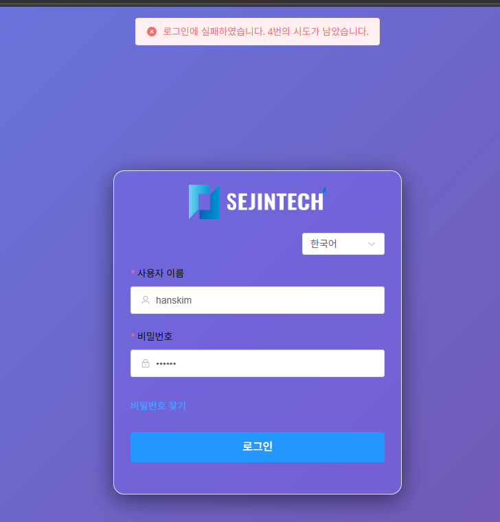
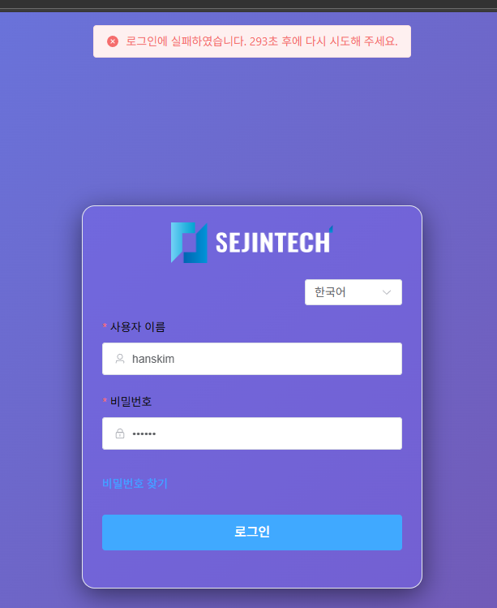
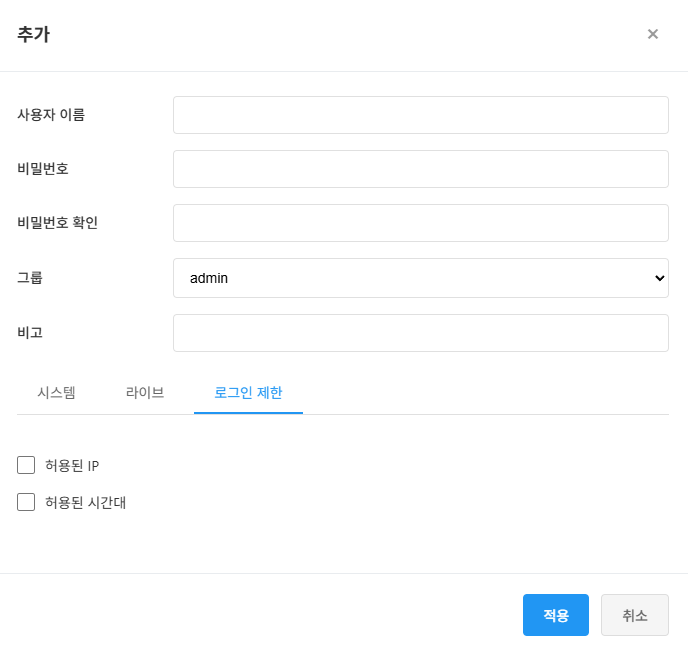
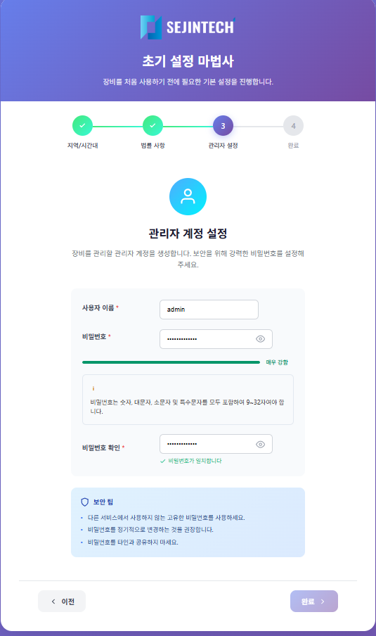
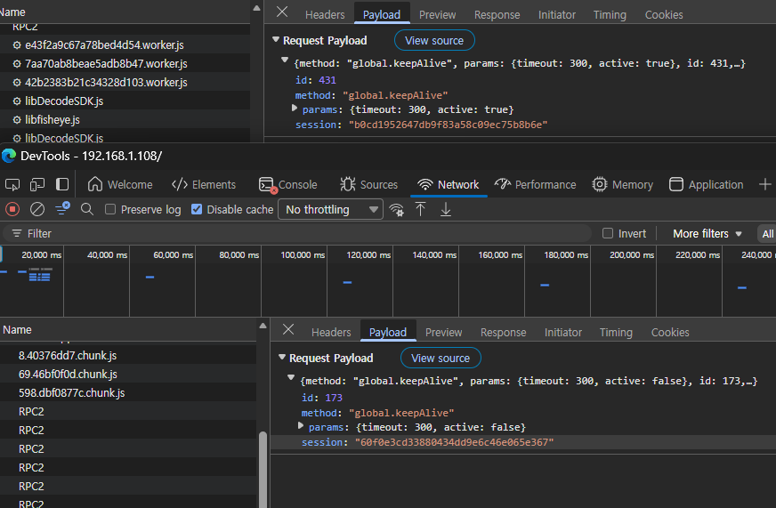

# 사용자식별, 로그인, 세션 관련 사항

본 문서는 **IP카메라 보안요구사항 V3.0**에서 로그인(식별 및 인증) 관련 요구사항을 발췌한 것입니다.

## 요약 체크리스트

| 항목 | 요구사항 | 조항 | 만족 여부 |
|:---:|:---|:---:|:---:|
| ✅ | 사용자 계정·패스워드 기반 식별 및 인증 | 2.2.1.1 | 만족 |
| ✅ | 연속 인증 실패 시 비활성화 (5회 이하) | 2.2.2.1 | 만족 |
| ✅ | 관리자 인증 실패 시 통보             | 2.2.2.2 | ?? |
| ✅ | 패스워드 9자리 이상 + 4종 문자 조합   | 2.2.3.1 | 개선 필요 |
| ✅ | 인증정보 재사용 방지 (세션 관리)      | 2.2.4.1 | 만족 |
| ✅ | 패스워드 입력 시 마스킹 (✽)         | 2.2.5.1 | 만족 |
| ✅ | 인증 실패 시 구체적 사유 미제공       | 2.2.5.2 | 만족 |
| ✅ | 기본 계정 강제 변경/사용중지         | 2.3.4.1 | ?? |
| ✅ | 기본 패스워드 강제 변경/생성         | 2.3.4.2 | ?? |
| ✅ | 세션 타임아웃 (10분 이하)           | 2.7.1.1 | 만족 |
| ✅ | 중복 접속 금지                     | 2.7.1.2 |
| ✅ | 패스워드 salt + hash 저장          | 2.4.2.1 | ?? |
| ✅ | 영상 프로토콜 인증 (ONVIF, RTSP)    | 2.1.1.1 |
| ✅ | 로그인 관련 감사기록 생성            | 2.8.1.1 |

---

## 1. 사용자 식별 및 인증

### 2.2.1.1 (필수) 사용자 계정·패스워드 기반 식별 및 인증
**원문:** "제품은 사용자의 신원을 검증하기 위해 사용자 계정·패스워드 기반 식별 및 인증 기능을 제공해야 한다."

- 사용자가 제품의 정당한 사용자임을 확인하기 위해 반드시 식별 및 인증을 수행해야 한다.
- 관리자는 각 사용자 또는 그룹별로 권한을 부여할 수 있어야 한다.
- 사용자 계정(ID)은 각각 고유한 값으로 등록되어 중복되지 않아야 한다.
> 모두 만족  
> 본 기기는 Challenge Response 방식을 사용하고 있다.  
> Challenge 단계(1단계)에서는 사용자 이름(userName) 안 장비에 보내고, 장비에서는 nonce 값(random, 10자리)을 포함한 정보를 반환한다.  
> front-end에서는 반환받은 nonce값과 realm(로그인 정보), Password 를 조합하고 암호화 하여 장비에 보내면, 장비는 1분동안 사용할 수 있는 session을 보내주고, 이후 모든 통신은 이 session을 통해서 이루어진다.
```
export function calculateLoginPassword(username, password, realm, random) {
  const response = md5(`${username}:${random}:${md5(`${username}:${realm}:${password}`)}`)
  return response
}
```
---

## 2. 인증 실패 대응

### 2.2.2.1 (필수) 연속 인증 실패 시 식별 및 인증 기능 비활성화
**원문:** "제품에서 사용자 인증이 설정된 횟수만큼 연속적으로 실패하면, 식별 및 인증 기능이 비활성화 되어야 한다."

- 식별 및 인증이 비활성화되는 연속적인 인증 실패 횟수는 **5회 이하**의 값으로 고정되거나 설정할 수 있어야 한다.
- 일정시간 동안 인증 기능을 비활성화하도록 구현하는 경우 재활성화까지 소요되는 시간은 **5분 이상**의 값으로 고정되거나 설정할 수 있어야 한다.
- 활성화 방법 예시: 계정잠금 후 지정된 시간이 지난 이후 활성화, 계정잠금 후 활성화를 위한 다른 식별 및 인증 수단 제공 등
> 우리는 5분간 로그인을 제한한다.  
> "계정 잠김. %d초 후에 다시 시도하십시오" 라는 메시지로 통일.




### 2.2.2.2 (필수) 관리자 인증 실패 시 즉시 통보
**원문:** "제품은 관리자 인증시 설정된 횟수만큼 연속적으로 실패하면, 관리자가 즉시 확인할 수 있는 수단을 통해 통보해야 한다."

- 알람, 문자 메시지, 이메일 등 중에서 **한 가지 이상**의 수단을 통해 통보해야 한다.
> 기능을 제공. email을 통해서 제공하게 한다.  
> 장비 초기화 단계에서 email을 설정할 수 있게 해야 할 필요가 있다.

---

## 3. 패스워드 보안성 기준

### 2.2.3.1 (필수) 패스워드 등록 및 변경 시 보안성 기준 만족
**원문:** "제품은 패스워드 등록 및 변경시 <표 1>의 보안성 기준을 만족해야 한다."

#### 준수사항
| 항목 | 요구사항 | 비고 |
|:---:|:---|:---|
| 최소 길이 | **9자리 이상** | 필수 |
| 대문자 포함 | 영문 대문자 1자 이상 포함 | A-Z |
| 소문자 포함 | 영문 소문자 1자 이상 포함 | a-z |
| 숫자 포함 | 숫자 1자 이상 포함 | 0-9 |
| 특수문자 포함 | 특수문자 1자 이상 포함 | !@#$%^&*() 등 |
| 복잡도 | 위 4가지 유형 **모두 혼합** 사용 | 필수 |

#### 금지사항
| 항목 | 요구사항 | 예시 |
|:---:|:---|:---|
| ID 포함 금지 | 비밀번호에 사용자 ID와 동일한 문자열 포함 금지 | ID가 `admin`이면 `admin123!` 금지 |
| 동일 문자 연속 | 동일한 문자 또는 숫자 연속 사용 금지 | `aaa`, `111`, `!!!` 금지 |
| 순차적 문자 | 키보드 연속 문자 순차 나열 금지 | `qwerty`, `asdf`, `1234` 금지 |
| 순차적 숫자 | 연속된 숫자 순차 나열 금지 | `123456`, `987654` 금지 |
| 이전 비밀번호 | 직전 사용 비밀번호 재사용 금지 | 최소 1회 이상 이력 관리 |


> 추가 개선 사항 : 비밀번호는 숫자, 대문자, 소문자 및 특수문자 중 최소 두 가지를 포함하여 8~32자여야 합니다(' " ; : &은 포함할 수 없습니다). \
> => <u>비밀번호는 숫자, 대문자, 소문자 및 특수문자를  <font color="red"> 모두 포함하여 9~32자</font>여야 합니다.</u>

> 사용자 추가시 
> payload:
``` 
{
    "method": "Security.addUserPlain",
    "params": {
        "cipher": "RPAC-256",
        "salt": "40c5a2b958132dd93d98e01385014d75ef15f0118c7b18472ccd0e0221c0a6df8721e57461cbb24f05c6e3f36d46ebfec5e8ee94d05cab8f1577ce8f27b065848335c4238eb005f6ce7d05b300e87144747e9de1eb2c24d19e4961fa586761c804b4fa009cb80187dea998da478d98afbbaeaafd9e8753d09a69221490879b627ffde50e8f9104f32c4b1152f8db7024f0412d538ec4e90ab68e1b74f236253c98cb521aa8ab6c48931a184b93e8cc92fd5b1bb24fc4564a1fd0e9cc809bc2a609bb247481b0a8b8befe82a0453e3da73866f729fbba1ad4859ba65e1a37fc3dbc89248bd0e76e63bcbf2865c17888df5d8558beebb807c5384184e7dfb3e230",
        "content": "7OH4rA0G4AgXLvivESVqU9rmqQ3cumIotXa/mJkjHcf/e9YllPKoO4Q5M09cEaQc7s4D5lie2lTb+4N4ur7k36xrNA76yfcujvbZG5oHzn2bE0h8lASSjnVLbrpT/WJaSGFj9wj6uqTbf9uuHkJBPo1v0+ghB8lzF4RAgzYvpRDxN9PHa6mHEtXV2PdMu7Xpl8d3yqa8jy97E/4qb5hGT6y9HMEm0sdqHPnhyCkT7M92E1WWEj8V+4xEUUqiWFWzTDp8Q99Qwy8ANws6rQqefJtHslNGHOuAhqJ68hl/Ro+E6ndBn0g3Qw9dA4HtvEejVaVRk8++qmY4lMZoJptHbDiQf81HzZ2nD6wf5kJHSt362haLyLZjsTVnW3wzakKFBLPBUhPBoG9fKeacvmMIhg=="
    },
    "id": 237,
    "session": "fc4b8e9722218f06aab2fd944080f77c"
}
```
> response:
```
{
    "id": 237,
    "params": {
        "content": "Tv5EjRzzLVq2/O3lntAZC3bTDGWwfdECx7KXoOxrlq0="
    },
    "result": true,
    "session": "fc4b8e9722218f06aab2fd944080f77c"
}
```
> 이런식으로 payload의 params.contents에 변조된 정보(ID와 password 노출이 안되게)로 전송한다.


---

## 4. 인증정보 재사용 방지

### 2.2.4.1 (필수) 인증 정보의 재사용 방지
**원문:** "제품은 사용자 인증 정보의 재사용을 방지해야 한다."

- 세션 ID를 암호화하거나 세션 ID의 유일성을 보장(타임스탬프, 세션 만료시간 설정 등)하여 방지할 수 있다.
- 재사용이 금지된 인증 정보의 재사용 시도를 탐지한 경우 **인증에 실패**해야 하며 인증 실패 사건에 대한 **감사기록을 생성**해야 한다.
- 세션 만료시간은 제공 서비스 특성을 고려하여 **최소화** 할 수 있는 값으로 설정해야 한다.
> session은 장비에서 제공하면 nonce(random)은 timestamp를 기준으로 작성되어 유일성을 보장한다.   
> 세션 만료시간은 기본적으로 60초이다.  
> 이미 사용된 session, expire된 session, 유효하지 않는 session으로 접속을 시도하면 log에 기록한다. (시간, 타입, 로그내용: 주소)

---

## 5. 인증 피드백 보호

### 2.2.5.1 (필수) 인증 정보 출력 시 내용 미표시
**원문:** "제품은 인증에서 사용되는 정보를 출력장치에 표시할 때 내용을 표시하지 않아야 한다."

- 인증에 사용되는 정보는 입력내용의 미표시, 입력문자 대신 "✽"으로 표시 등의 형태로 출력해야 한다.
- 사용자 로그인시 인증 정보가 **메모리 영역에 평문으로 노출되지 않아야** 한다.
> 요구사항 만족

### 2.2.5.2 (필수) 인증 실패 시 실패 사유 미제공
> 원문: "제품은 식별 및 인증 실패시, 실패 사유에 대한 피드백(존재하지 않는 계정(ID), 패스워드 오류 등)을 제공하지 않아야 한다."

- 잘못된 인증 정보 입력으로 인증실패 유도 후, 알림 메시지에 인증 실패 사유를 추측할 수 있는 피드백을 제공하면 안 됨
- 예: "로그인에 실패하였습니다." 만 표시 (계정 없음, 비밀번호 틀림 등 구체적 사유 미제공)
> 개선 요구: "로그인에 실패하였습니다" 만 출력  
> api 응답에 실패 사유가 나옴.
```
{
    "error": {
        "code": 268632085,
        "message": "Component error: User or password not valid!"
    },
    "id": 5,
    "params": {
        "remainLockSecond": 0,
        "remainLoginTimes": 3
    },
    "result": false,
    "session": 76594003
}
```
> error.message 의  "Component error: User or password not valid!" 를 "Component error: Login failed" 만 나오게 수정

---

## 6. 기본 계정 및 패스워드 관리

### 2.3.4.1 (필수) 기본 제공 계정의 강제 변경·사용중지
**원문:** "제품은 최초 제품 접속(웹 브라우저 접속 등) 시 기본 제공되는 계정에 대한 강제 변경·사용중지하는 기능을 제공해야 한다."

- 최초 접속시, 기본 제공되는 계정을 화면에 출력해야 한다.
- 기본 제공되는 계정은 최초 접속시 **강제 변경 또는 사용중지(Disable)** 되어야 한다.
- 기본 제공되는 계정이 없는 경우, **신규 계정을 생성**해야 하며 이후 제품의 관리 접속이 가능해야 한다.
- 계정을 변경하거나 신규 생성할 경우, **유추가 가능한 명칭(root, admin, 업체명, 카메라 모델명 등)은 허용하지 않아야** 한다.
> 현재 init 상태(최초 접속)에서는 admin 의 ID를 설정하게 되어 있다. 
> 설명의 내용으로 보아 admin이 아니고 사용자(admin role)의 ID를 직접 입력하게 해야 한다는 의미 인것 같다. 


### 2.3.4.2 (필수) 기본(default) 패스워드 강제 변경·생성
**원문:** "제품은 최초 제품 접속(웹 브라우저 접속 등) 시 관리자 기본(default) 패스워드를 강제 변경·생성하는 기능을 제공해야 한다."

- 기본(default) 패스워드가 존재하는 경우 최초 제품 접속시 기본(default) 패스워드를 **변경하는 기능**을 제공해야 한다.
- 기본(default) 패스워드가 없는 경우, **신규 패스워드를 생성**해야 한다.
- 패스워드는 **2.2.3.1의 보안성 기준**을 준수해야 한다.
- 제품의 **모든 기능은 기본(default) 패스워드 변경 또는 생성이 진행된 이후에만** 동작되어야 한다.

> 
> 기본 패스워드는 없고 새로 생성하는 기능만 제공하면 됨.

---

## 7. 세션 관리

### 2.7.1.1 (필수) 세션 잠금·종료 기능
**원문:** "제품은 관리자 세션 연결 이후 일정시간 동안 사용하지 않을 경우, 세션을 잠그거나 종료하는 기능을 제공해야 한다."

- 일정시간은 관리자가 **10분 이하**의 값 중에서 고정하거나 설정할 수 있다.
- 잠겨진 세션은 잠금시간이 경과한 후, 관리자에 의하거나 각 세션별 사용자 인증 기능을 통해서 해제되어야 한다.
- 세션 잠금이나 종료 기능 동작시 **감사기록을 생성**해야 한다.
- 영상 모니터링 기능에서 일정시간이 경과하고 다른 관리 기능으로 전환을 시도할 때 **사용자 인증이 요구**되어야 한다.

> 기본적인 session expire time은 60초 이다.   
> front-end에서 keep-alive를 요청하여 session expire time을 연장할 수 있다. 
> 마우스의 동작이 있을때마다 세션 연장을 요구하고 있다. 마지막 마우스 동작후 1분이 지나면 session은 expire 된다.

### 2.7.1.2 (필수) 중복 접속 금지
**원문:** "제품은 동일한 관리자 계정 또는 동일 권한을 사용하여 제품 중복 접속을 허용하지 않아야 한다."

- 사용자 로그인 이후 다른 단말기에서 동일 계정으로 로그인을 수행하는 경우 **신규 접속을 차단**하거나 **이전 접속의 종료를 요구**한다.
- 동일 권한으로 중복 로그인을 허용하지 않아야 한다.
- 중복 접속 차단시 **감사기록을 생성**해야 한다.
- 영상 모니터링·PTZ 등 카메라 제어 목적으로 접속하는 관리자 계정 및 권한에 대해서는 적용하지 않을 수 있다.
> 이 부분은 구현 되지 않은 것 같다. 같은 user로 세션을 중복발행 하면 안됨.  
> 같은 user가 다른 세션으로 접속하는 것도 차단하고, log에 기록해야 한다.


---

## 8. 저장 데이터 보호 (패스워드 저장)

### 2.4.2.1 (필수) 패스워드 암호화 저장
**원문:** "중요정보를 제품 내부에 저장할 때 정해진 방식으로 저장해야 한다."

- 제품이 사용자 식별 및 인증을 위해 사용하는 패스워드는 **암호화하여 저장**해야 한다.
- 사용자 패스워드는 **일방향 암호(해시) 또는 양방향 암호**를 이용하여 저장해야 한다.
- 일방향 암호화 수행시 패스워드에 **salt**라는 랜덤하게 생성한 값을 추가하여 적용할 필요가 있다.
  - salt 값은 비밀일 필요는 없으며, 난수발생기를 이용하여 생성
  - salt 크기는 **최소 48bit 이상**이어야 한다.
  - iteration count는 가능한 큰 값을 적용해야 한다. (**최소 1000회 이상**)
- 암호화해서 저장해야 하는 패스워드 및 암호키는 **제품에 하드코딩하여 저장할 수 없다**.
> 이 부분은 업체에 요건에 맞게 저장해야 함을 요구해야 한다.
> 현재 salt는 256바이트 인것 같다. 실제 저장하는 salt는 어떤지 알아야 함.
---

## 9. 영상 프로토콜 인증

### 2.1.1.1 (필수) 영상 프로토콜에서 사용자 인증 제공
**원문:** "기기 간 연동 및 영상 관련 표준 프로토콜(ONVIF, RTSP 등)에서 사용자 인증 기능을 제공해야 한다."

- ONVIF, RTSP 등 표준 프로토콜에서 사용자 인증 제공
- Digest 인증 사용 시 **RFC 7616** 준수
- 암호 알고리즘 보안강도 **112bit 이상**
> RTSP over TLS를 사용할 예정. Digest 사용  
> 요구사항에 맞게 수정해야 함.


---

## 10. 로그인 관련 감사기록

### 2.8.1.1 (필수) 로그인 관련 감사사건 기록
**원문:** "제품은 주요 감사사건에 대해 감사기록을 생성해야 한다."

필수 기록되어야 할 로그인 관련 감사사건:

| 분류 | 감사사건 | 구현 여부|
|:---:|:---|:--:|
| 식별 및 인증 | 사용자의 로그인, 로그아웃 | ✅|
| 식별 및 인증 | 사용자 등록, 변경, 삭제 |✅|
| 식별 및 인증 | 사용자 인증 시도의 한계치 도달시 대응행동 |
| 식별 및 인증 | 패스워드에 대한 모든 변경 |✅ 사용자 수정?|
| 보안관리    | 기본 계정(ID)·패스워드 변경 |
| 보안관리    | 관리용 단말 접속 IP 차단 |
| 세션 관리   | 사용자의 세션 잠금 또는 세션 종료 |X|
| 세션 관리   | 동일 계정의 중복 로그인 시도 탐지시 대응행동 |X|
| 세션 관리   | 동일세션 수 제한에 기반한 새로운 세션 거부 |X|

---

## 참고: 현재 구현된 인증 방식 (Challenge-Response) 로그인

현재 카메라는 **표준 HTTP Digest 인증을 JSON-RPC 형태로 감싼 Challenge–Response 기반 사용자 인증** 방식을 사용합니다.

### 1단계: Login Challenge (도전 요청)
```
api: https://192.168.1.108/RPC2_Login, POST
payload: {
  "method": "global.login",
  "params": {
      "userName": "admin",
      "password": "",
      "clientType": "Web5.0"
  },
  "id": 4
}
```

응답 필드:
| 필드 | 의미 |
|:---:|:---|
| `realm` | 인증 영역 식별자 (Digest 표준) |
| `random` | **nonce** (일회성 난수) |
| `opaque` | 서버 상태 보호용 토큰 |
| `qop` | quality of protection (`auth`) |
| `authorization` | 서버 내부 검증용 |
| `session` | 인증 전 임시 세션 |

### 2단계: 인증 응답
```
password 필드 계산:
export function calculateLoginPassword(username, password, realm, random) {
  const ha1 = md5(`${username}:${realm}:${password}`)
  const response = md5(`${username}:${random}:${ha1}`)
  return response
}
```

**핵심**: 카메라는 평문 비밀번호를 절대 받지 않고, 1단계에서 nonce(random)를 내려주고, 2단계에서 Digest 해시로 검증하는 구조입니다.


## 참고: 현재 구현된 인증 방식 (Challenge-Response) Websocket

websocket에 연결되면 그 연결된 socket을 통해 challenge response 방식으로 인증을 하고,
인증을 통과한 후에 영상을 받을 수 있다.
```
Request:
GET /live/realmonitor.xav?channel=1&subtype=0&method=0 HTTP/1.1
Accept-Sdp: Private
Authorization: WSSE profile="UsernameToken"
Connection: keep-alive
Cseq: 0
Host: 192.168.1.108:8086
Range: npt=0.000000-
WSSE: UsernameToken Username="admin", PasswordDigest="M23Dqy2txm6nduULaopvZ1qb4Gs=", Nonce="EFA5A9EC57A437755FDE391B657561EA", Created="2025-12-23T19:13:03Z"


Response:
HTTP/1.1 401 Unauthorized
Cache-Control: no-cache
Cseq: 0
Session-Id: 64201536
User-Agent: Http Stream Server/1.0
WWW-Authenticate:  Digest realm="Login to dd1176c88fde59a5d01a6be0c45b9630", nonce="e6eb5b84b4d365a45f8022f5a40d2459"


Request:
GET /live/realmonitor.xav?channel=1&subtype=0&method=0 HTTP/1.1
Accept-Sdp: Private
Authorization: Digest username="admin", realm="Login to dd1176c88fde59a5d01a6be0c45b9630", nonce="e6eb5b84b4d365a45f8022f5a40d2459", uri="/live/realmonitor.xav?channel=1&subtype=0", response="df761088b0aceb3a24317badac34d248"
Connection: keep-alive
Cseq: 1
Host: 192.168.1.108:8086
Range: npt=0.000000-


Response:
HTTP/1.1 200 OK
Cache-Control: no-cache
Connection: close
Content-Type: video/x-xav
Cseq: 1
KeepLive-Time: 60
Private-Length: 640
Private-Type: application/sdp
Range: npt=0.000000-
Session-Id: 64201536
User-Agent: Http Stream Server/1.0

v=0
o=- 2273699856 2273699856 IN IP4 0.0.0.0
s=Media Server
c=IN IP4 0.0.0.0
t=0 0
a=control:*
a=packetization-supported:DH
a=rtppayload-supported:DH
a=range:npt=now-
a=x-summary:Mainland
a=x-packetization-supported:IV
a=x-rtppayload-supported:IV
m=video 0 RTP/AVP 96
a=control:trackID=0
a=framerate:30.000000
a=rtpmap:96 H264/90000
a=recvonly
m=application 0 RTP/AVP 100
a=control:trackID=3
a=rtpmap:100 stream-assist-frame/90000
a=recvonly
m=application 0 RTP/AVP 107
a=control:trackID=4
a=rtpmap:107 vnd.onvif.metadata/90000
a=recvonly
m=audio 0 RTP/AVP 8
a=control:trackID=6
a=rtpmap:8 PCMA/8000
a=recvonly
```

---

