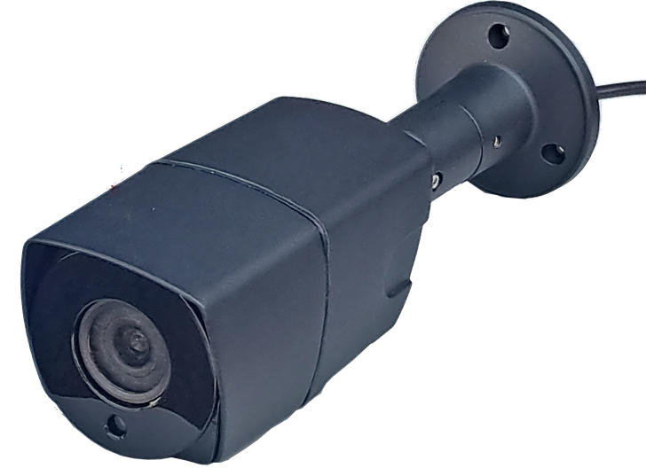
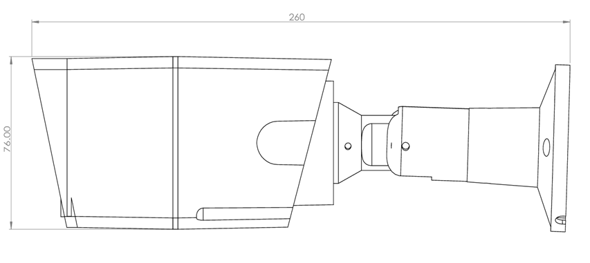

# 📷 IP Camera 하드웨어 스펙


## 📋 기본 정보

| 항목 | 값 |
|------|-----|
| **장치 모델** | SJ6102QH-FC-6211 |
| **ONVIF 버전** | 23.12 (Profile 3.1.0.1827088) |
| **시스템 버전** | V3.120.0000000.4.R |
| **빌드 날짜** | 2024-09-24 |
| **웹 버전** | V5.01.0.2059238 |

---

## 🎥 카메라

| 항목 | 사양 |
|------|------|
| **이미지 센서** | 1/1.8" CMOS |
| **최대 해상도** | 2688 × 1520 |
| **ROM** | 256 MB |
| **RAM** | 1 GB |
| **스캐닝 방식** | Progressive |
| **전자 셔터 속도** | Auto/Manual 1/3s ~ 1/100,000s |
| **최저 조도** | 0.0005 lux @ F1.0 |
| **S/N 비율** | > 56 dB |
| **조명 거리** | 최대 40m (131.23 ft) |
| **조명 제어** | Auto / Manual |
| **조명 개수** | 4개 (Warm light) |
| **각도 조절** | Pan: 0°~360° / Tilt: 0°~90° / Rotation: 0°~360° |

---

## 🔭 렌즈

| 항목 | 사양 |
|------|------|
| **렌즈 타입** | Fixed-focal |
| **렌즈 마운트** | M16 |
| **초점 거리** | 2.8mm / 3.6mm / 6mm |
| **최대 조리개** | F1.0 (전 렌즈 공통) |
| **조리개 제어** | Fixed |

### 화각 (Field of View)

| 렌즈 | 수평(H) | 수직(V) | 대각(D) |
|------|---------|---------|---------|
| 2.8mm | 112° | 60° | 135° |
| 3.6mm | 95° | 51° | 116° |
| 6mm | 58° | 31° | 69° |

### 최소 초점 거리

| 렌즈 | 거리 |
|------|------|
| 2.8mm | 1.6m (5.25 ft) |
| 3.6mm | 2.6m (8.53 ft) |
| 6mm | 5.3m (17.39 ft) |

### DORI 거리 (EN-62676-4)

| 렌즈 | Detect | Observe | Recognize | Identify |
|------|--------|---------|-----------|----------|
| 2.8mm | 58.2m | 23.3m | 11.6m | 5.8m |
| 3.6mm | 70.3m | 28.1m | 14.1m | 7.0m |
| 6mm | 116.1m | 46.5m | 23.2m | 11.6m |

> 💡 **DORI**: Detect, Observe, Recognize, Identify - 영상을 통해 사람/물체를 식별하는 능력을 정의하는 표준 시스템

---

## 🧠 지능형 기능 (Intelligence)

| 기능 | 설명 |
|------|------|
| **SMD 3.0** | Smart Motion Detection - 사람 및 차량 감지 |

---

## 📹 비디오

| 항목 | 사양 |
|------|------|
| **비디오 압축** | H.265 / H.264 / H.264H / H.264B / MJPEG (서브 스트림만) |
| **스마트 코덱** | Smart H.265+ / Smart H.264+ |
| **AI 코딩** | AI H.265 / AI H.264 |
| **스트림 수** | 3 스트림 |
| **비트레이트 제어** | CBR / VBR |
| **WDR** | 140 dB |
| **노이즈 감소** | 3D NR |
| **모션 감지** | ON/OFF (4개 영역, 직사각형) |
| **ROI** | 4개 영역 |
| **프라이버시 마스킹** | 4개 영역 |
| **이미지 회전** | 0° / 90° / 180° / 270° |
| **미러** | 지원 |
| **안개 제거** | 지원 |
| **LDC** | 지원 (2.8mm/3.6mm만) |

### 프레임 레이트

| 스트림 | 해상도 | 프레임 레이트 |
|--------|--------|---------------|
| Main | 2688 × 1520 | 1~25/30 fps |
| Sub | D1 | 1~25/30 fps |
| Third | 1080p | 1~25/30 fps |

### 지원 해상도

```
2688×1520 | 2560×1440 | 2048×1536 | 2304×1296 | 1080p | 1.3M | 720p | D1 | VGA | CIF
```

### 비트레이트

| 코덱 | 범위 |
|------|------|
| H.264 | 32 ~ 16,384 kbps |
| H.265 | 12 ~ 16,384 kbps |

---

## 🔊 오디오

| 항목 | 사양 |
|------|------|
| **내장 마이크** | 있음 |
| **오디오 압축** | PCM / G.711a / G.711Mu / G.726 / G.723 |

---

## ⚠️ 알람 이벤트

```
네트워크 끊김 | IP 충돌 | 불법 접근 | 모션 감지 | 비디오 변조 | 
오디오 감지 | 전압 감지 | 외부 알람 | SMD | 보안 예외
```

---

## 🌐 네트워크

| 항목 | 사양 |
|------|------|
| **네트워크 포트** | RJ-45 (10/100 Base-T) |
| **SDK/API** | 지원 |
| **상호운용성** | ONVIF (Profile S/G/T), CGI |
| **동시 접속** | 20명 (총 대역폭: 80 Mbps) |

### 지원 프로토콜

```
IPv4 | IPv6 | HTTP | TCP | UDP | ARP | RTP | RTSP | RTCP | RTMP | SMTP | 
FTP | SFTP | DHCP | DNS | DDNS | QoS | UPnP | NTP | Multicast | ICMP | 
IGMP | NFS | PPPoE | SNMP | P2P
```

### 지원 브라우저

| 브라우저 | 최소 버전 |
|----------|-----------|
| Internet Explorer | 11 이상 |
| Chrome | 45 이상 |
| Firefox | 46 이상 |
| Safari | 12 이상 |

---

## 🔒 사이버 보안

```
비디오 암호화 | 펌웨어 암호화 | 설정 암호화 | Digest | WSSE | 계정 잠금 | 
보안 로그 | IP/MAC 필터링 | X.509 인증서 생성/가져오기 | Syslog | HTTPS | 
802.1x | Trusted Boot | Trusted Execution | Trusted Upgrade
```

---

## 🔌 포트

| 포트 | 사양 |
|------|------|
| **오디오 입력** | 1채널 (RCA) |

---

## ⚡ 전원

| 항목 | 사양 |
|------|------|
| **전원 공급** | 12V DC / PoE (802.3af) / ePoE |
| **이중 전원 백업** | 지원 (어댑터 + PoE 동시 사용 시 하나 분리해도 동작 유지) |

### 소비 전력

| 상태 | 12V DC | PoE |
|------|--------|-----|
| 기본 | 2.7W | 4.2W |
| 최대* | 8.9W | 11.6W |

> *최대: H.265+ / Warm Light / Intelligence ON / WDR

---

## 🌡️ 환경

| 항목 | 사양 |
|------|------|
| **동작 온도** | -40°C ~ +60°C |
| **동작 습도** | ≤ 95% |
| **보관 온도** | -40°C ~ +60°C |
| **보관 습도** | 10% ~ 95% (비응결) |
| **방수/방진** | IP67 |

---

## 📐 구조

| 항목 | 사양 |
|------|------|
| **케이스 재질** | Metal |
| **제품 크기** | 260.5 × 76 × 76 mm |
| **순중량** | 825g (1.82 lb) |
| **총중량** | 1,054g (2.32 lb) |


---

## 📜 인증

| 인증 | 규격 |
|------|------|
| **CE-LVD** | EN62368-1 |
| **CE-EMC** | Electromagnetic Compatibility Directive 2014/30/EU |
